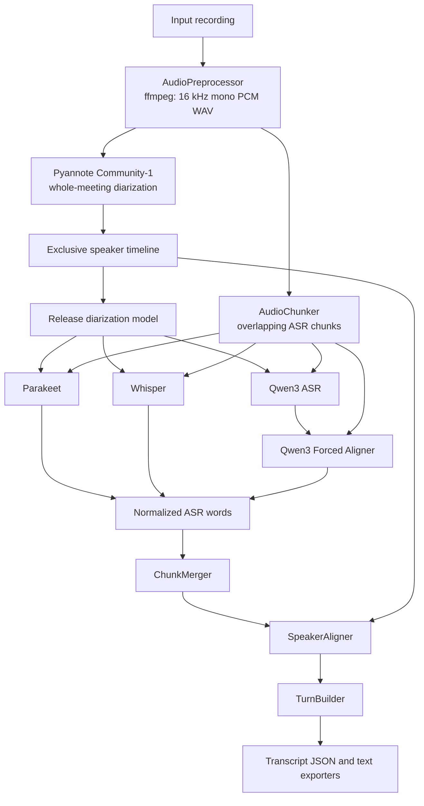

# German Meeting Transcriber

Local, batch-friendly German meeting transcription using pyannote Community-1 for anonymous speaker diarization and interchangeable Parakeet, Whisper, or Qwen ASR. It intentionally contains no summarization, LLM post-processing, API service, or remote inference.

## Architecture



Pyannote owns canonical speaker identity. No ASR backend speaker labels are used. Downstream components consume only the common `ASRWord` contract.

## ASR Backends

- Parakeet: `nvidia/parakeet-tdt-0.6b-v3`. Native Transformers TDT timestamps, punctuation, and capitalization.
- Whisper: `openai/whisper-large-v3`. German transcription is explicitly requested with Transformers word timestamps.
- Qwen: `Qwen/Qwen3-ASR-1.7B-hf` transcribes each chunk, then `Qwen/Qwen3-ForcedAligner-0.6B-hf` supplies native word start/end timing. The two models run sequentially: ASR is loaded once for all chunks and released before the aligner is loaded once.
- Diarization: `pyannote/speaker-diarization-community-1` runs over the normalized full meeting and exposes its exclusive speaker timeline.

All adapters use deterministic inference, `model.eval()`, `torch.inference_mode()`, and `trust_remote_code=False`. CUDA uses FP16 on Turing-class GPUs and BF16 only where PyTorch confirms support; CPU uses FP32.

## Prerequisites

- Python 3.11
- `ffmpeg` and `ffprobe` on `PATH`
- enough RAM, or an NVIDIA GPU for practical production inference
- a Hugging Face token only when downloading the gated pyannote model

## Python Setup

| Package | Version |
| --- | --- |
| Python | `>=3.11,<3.14` |
| torch | `2.8.0` |
| torchaudio | `2.8.0` |
| torchcodec | `0.7.0` |
| transformers | `5.13.0` |
| accelerate | `1.12.0` |
| librosa | `0.11.0` |
| pyannote.audio | `4.0.7` |
| numpy | `2.2.6` |

Install the appropriate PyTorch CPU/CUDA wheel first when required by the package index, then install the project:

```bash
python3.11 -m venv .venv
.venv/bin/pip install --upgrade pip
.venv/bin/pip install -e '.[dev]'
```

## CLI

```bash
meeting-transcriber transcribe INPUT --output OUTPUT [options]
meeting-transcriber compare INPUT --output OUTPUT [options]
```

Supported values for `--asr` and `--models` are `parakeet`, `whisper`, and `qwen`.

Options include `--asr-model`, `--qwen-aligner-model`, `--pyannote-model`, `--device auto|cuda|cpu`, `--chunk-duration`, `--chunk-overlap`, `--num-speakers`, `--min-speakers`, `--max-speakers`, `--working-directory`, `--keep-intermediate`, and `--log-level`.

Parakeet and Whisper default to 180-second chunks with 15-second overlap. Qwen defaults to 240-second chunks with 15-second overlap. The Qwen forced aligner accepts at most approximately five minutes, so Qwen rejects a chunk duration over 300 seconds before processing begins.

```bash
meeting-transcriber transcribe meeting.m4a \
  --asr parakeet --output ./result/parakeet --device cuda

meeting-transcriber transcribe meeting.m4a \
  --asr whisper --output ./result/whisper --device cuda

meeting-transcriber transcribe meeting.m4a \
  --asr qwen --output ./result/qwen --device cuda

meeting-transcriber transcribe meeting.m4a \
  --asr qwen \
  --asr-model /models/qwen3-asr-1.7b \
  --qwen-aligner-model /models/qwen3-forced-aligner-0.6b \
  --output ./result/qwen --device cuda
```

Configuration precedence is CLI arguments, environment variables, then defaults:

```text
ASR_BACKEND
ASR_MODEL
QWEN_ALIGNER_MODEL
PYANNOTE_MODEL
DEVICE
WORKING_DIRECTORY
CHUNK_DURATION
CHUNK_OVERLAP
NUM_SPEAKERS
MIN_SPEAKERS
MAX_SPEAKERS
KEEP_INTERMEDIATE_FILES
LOG_LEVEL
HF_HOME
HF_TOKEN
```

`ASR_BACKEND` defaults to `parakeet`. `ASR_MODEL` selects the ASR model or a local path; for Qwen, `QWEN_ALIGNER_MODEL` selects the second local model artifact.

## Output and Provenance

`OUTPUT/transcript.json` is canonical and versioned (`"version": "1.0"`). It contains source metadata, backend/model metadata, anonymous `SPEAKER_XX` IDs, derived turns, and speaker-attributed words. All normal backends provide native word starts and ends.

With `--keep-intermediate`, `OUTPUT/intermediate/diarization.json`, `asr_words.json`, and `attributed_words.json` are retained. Qwen keeps recognized chunk text in memory only until forced alignment completes; it never leaks Qwen-specific data into the common downstream pipeline.

Comparison metadata records backend/model references, configured chunking, dtype, PyTorch and Transformers versions, total time, RTF, peak CUDA memory, and Qwen phase timings. `comparison/qwen/metadata.json` additionally records the Qwen ASR and forced-aligner model references and their load, inference/alignment, and unload timings.

For controlled air-gap imports, pin approved upstream revisions and record SHA256 checksums outside the runtime pipeline. The application does not hash multi-gigabyte model artifacts at transcription time and does not make metadata/version network calls.

## Offline and Air-Gapped Models

On a connected staging system, download approved model revisions through the organization’s approved process:

```bash
HF_TOKEN=hf_... meeting-transcriber prefetch-models --asr parakeet
HF_TOKEN=hf_... meeting-transcriber prefetch-models --asr whisper
HF_TOKEN=hf_... meeting-transcriber prefetch-models --asr qwen
```

Also obtain the accepted `pyannote/speaker-diarization-community-1` artifact through the approved process. Transfer approved model artifacts and their externally generated checksums through the organization’s air gap. A production model volume can contain:

```text
/models/
├── pyannote-community-1/
├── parakeet-tdt-0.6b-v3/
├── whisper-large-v3/
├── qwen3-asr-1.7b/
└── qwen3-forced-aligner-0.6b/
```

Run from local paths with runtime network access disabled:

```bash
HF_HUB_OFFLINE=1 \
TRANSFORMERS_OFFLINE=1 \
ASR_BACKEND=qwen \
ASR_MODEL=/models/qwen3-asr-1.7b \
QWEN_ALIGNER_MODEL=/models/qwen3-forced-aligner-0.6b \
PYANNOTE_MODEL=/models/pyannote-community-1 \
meeting-transcriber transcribe /data/meeting.m4a --output /data/result --device cuda
```

After local model artifacts are available, production inference requires no network access and no Qwen/Alibaba API credential.

## Podman

Build the single common, non-root OpenShift-compatible image:

```bash
podman build -t meeting-transcriber:local -f Containerfile .
```

Run with locally mounted models in an air-gapped environment:

```bash
podman run --rm --device nvidia.com/gpu=all \
  --userns=keep-id --user "$(id -u):$(id -g)" \
  -e HF_HUB_OFFLINE=1 -e TRANSFORMERS_OFFLINE=1 \
  -e ASR_BACKEND=qwen \
  -e ASR_MODEL=/models/qwen3-asr-1.7b \
  -e QWEN_ALIGNER_MODEL=/models/qwen3-forced-aligner-0.6b \
  -e PYANNOTE_MODEL=/models/pyannote-community-1 \
  -v "$PWD/input:/input:ro,Z" -v "$PWD/result:/output:Z" \
  -v "$PWD/work:/work:Z" -v "$PWD/models:/models:ro,Z" \
  meeting-transcriber:local transcribe /input/meeting.m4a \
  --output /output --working-directory /work --device cuda
```

The image does not contain model weights, accepts an arbitrary OpenShift UID, and writes only to `/work`, `/cache`, or mounted output locations.

## OpenShift

`deploy/openshift/job.example.yaml` requests one GPU and demonstrates mounted local Qwen, forced-aligner, and pyannote model paths with `HF_HUB_OFFLINE=1` and `TRANSFORMERS_OFFLINE=1`. It requires no network egress and leaves object storage and orchestration outside this application.

## Manual Comparison

Normalization and pyannote run once; ASR backends execute sequentially on the same prepared meeting:

```bash
meeting-transcriber compare meeting.m4a \
  --models parakeet,whisper,qwen \
  --output ./comparison --device cuda
```

```text
comparison/
├── diarization.json
├── metadata.json
├── parakeet/
│   ├── asr_words.json
│   ├── transcript.json
│   └── transcript.txt
├── whisper/
│   ├── asr_words.json
│   ├── transcript.json
│   └── transcript.txt
└── qwen/
    ├── asr_words.json
    ├── metadata.json
    ├── transcript.json
    └── transcript.txt
```

The shared comparison chunks use the command’s explicit settings or the regular 180-second/15-second defaults, which remain within Qwen’s forced-alignment limit.

## Limitations

- Qwen forced alignment is limited to approximately five-minute chunks and fails the Qwen backend rather than fabricating untimestamped words.
- Parakeet native Transformers output is timestamped tokenizer pieces; its adapter groups them into words.
- Whisper word timestamps can drift around rapid or overlapping speech.
- ASR timestamps and pyannote speaker boundaries can still be imperfect around overlaps.
- Speaker IDs are anonymous voices, not real identities.
- German is the intended language.

## Verification

Normal tests download no models and require no GPU:

```bash
pytest
ruff check .
mypy src/meeting_transcriber
```

An optional real-model smoke test requires predownloaded local artifacts, a German WAV, and `RUN_MODEL_TESTS=1 MODEL_TEST_BACKEND=qwen MODEL_TEST_AUDIO=/path/to/audio.wav pytest tests/integration`.
