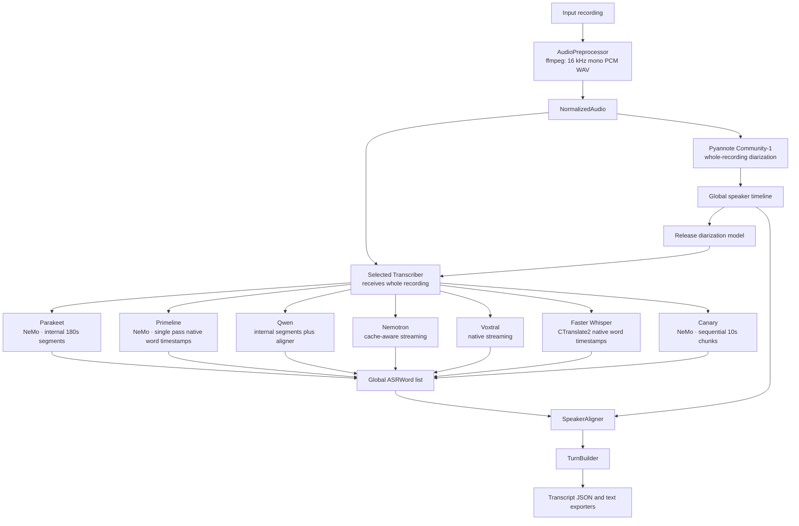

# Speech Transcription Pipeline

Local, batch-friendly speech transcription with anonymous pyannote Community-1 diarization. It has no summarization, API service, remote inference, or vLLM dependency. Base artifact/finalization paths have no NeMo dependency; the NeMo runtime image installs NeMo only for its recognition tasks.

## Backend and runtime identity

Backends are the application's domain abstraction; runtimes are a deployment detail. Public backend names never change.

| Runtime | Backends | Image |
| --- | --- | --- |
| Transformers | `qwen`, `nemotron`, `voxtral`, plus `prepare`/pyannote and finalization | `Containerfile.transformers` |
| NeMo | `parakeet`, `primeline`, `canary` | `Containerfile.nemo` |
| CTranslate2 | `faster-whisper` | `Containerfile.ctranslate2` |

The authoritative in-code mapping is `BACKEND_RUNTIMES` in `src/speech_transcriber/config.py`.

## License

This project is licensed under the [Apache License 2.0](LICENSE). Model weights are not distributed with this repository and remain subject to the licenses and terms of their respective providers.

This project is licensed under the [Apache License 2.0](LICENSE). Model weights are not distributed with this repository and remain subject to the licenses and terms of their respective providers.

## Architecture



Audio segmentation is not part of the generic pipeline. Each ASR backend owns its own long-form processing strategy and returns finalized, globally timestamped `ASRWord` values. Pyannote owns canonical speaker identity; ASR speaker labels are never used.

## ASR Backends

- `parakeet`: `nvidia/parakeet-tdt-0.6b-v3`. NVIDIA NeMo runtime; the checkpoint `parakeet-tdt-0.6b-v3.nemo` is restored offline with `ASRModel.restore_from()` and provides native word timestamps, punctuation, and capitalization. Internal 180-second segments with 15-second overlap are retained; no forced alignment.
- `primeline`: `primeline/parakeet-primeline`. A German-focused Parakeet TDT (FastConformer) fine-tune distributed as a NVIDIA NeMo `.nemo` checkpoint (`2_95_WER.nemo`), running on the NeMo runtime alongside Parakeet and Canary. The checkpoint is restored offline with `ASRModel.restore_from()` from an explicit local path or the deterministic local Hugging Face cache snapshot (`refs/main`). Recognition transcribes the whole normalized WAV in one call with native word timestamps (relying on the checkpoint's local-attention long-form behavior), no chunking, no forced alignment, and canonical confidence is unset unless NeMo exposes a per-word value.
- `qwen`: `Qwen/Qwen3-ASR-1.7B-hf` plus `Qwen/Qwen3-ForcedAligner-0.6B-hf`. Qwen recognizes bounded 240-second internal segments with 15-second overlap, releases ASR, aligns all recognized segments once, then reconciles them. Collapsed 80 ms-grid boundaries are interpolated and reported in metadata. The aligner limit is 300 seconds.
- `nemotron`: `nvidia/nemotron-3.5-asr-streaming-0.6b`. Native Transformers RNNT cache-aware streaming, explicit language conditioning, native token emission timestamps, and internal token-to-word aggregation. Batch transcription defaults to 13 lookahead tokens (1.12s latency) for the model's highest-accuracy streaming configuration. It does not issue independent ASR requests for long-form audio.
- `voxtral`: `mistralai/Voxtral-Mini-4B-Realtime-2602`. Native Transformers cache-aware streaming in one continuous `generate()` session using processor-defined buffers and EOF padding. `[STREAMING_WORD]` token positions provide approximate emission-group end times; starts remain unset for speaker alignment to infer.
- `faster-whisper`: `Systran/faster-whisper-large-v3`. Backend = `faster-whisper`, runtime = CTranslate2. A distinct heterogeneous runtime using the native `faster-whisper` / CTranslate2 stack, not Transformers. It is not a restoration of the previously removed Transformers Whisper backend. Native word start/end timestamps and word probabilities map directly to canonical `ASRWord` records; no forced alignment is used. GPU recognition defaults to `float16` compute type; VAD is disabled by default (`vad_filter=False`) because the pipeline already normalizes the full recording and diarizes it separately with pyannote. The configured language is reduced to a Whisper base code (`de-DE` -> `de`); without a language, the model detects it and the detected language/probability is recorded in backend metadata.
- `canary`: `nvidia/canary-1b-v2` (CC BY 4.0). NVIDIA NeMo runtime batch recognition for multilingual ASR, including German (`de`). It performs transcription only: `source_lang` and `target_lang` are both the normalized configured language. The adapter splits the normalized WAV into deterministic non-overlapping PCM chunks (default 10 seconds, exact frame boundaries), transcribes them sequentially with a single model load, and rebases native `Hypothesis.timestamp["word"]` records to recording-global `word`, `start`, and `end` values, including punctuation/capitalization; Canary exposes no stable native per-word confidence, so canonical confidence is `null`. No forced alignment, translation, speaker attribution, or manual timestamp de-duplication is used.
- Diarization: `pyannote/speaker-diarization-community-1` runs once over the normalized full recording.

Nemotron word intervals are aggregates of RNNT token emission times, not manually aligned acoustic boundaries. Leading-space tokenizer markers start words; standalone trailing punctuation attaches to the preceding word without extending its lexical end to the punctuation emission frame; opening punctuation attaches to the following lexical token. Punctuation emitted in the same token as lexical text remains inseparable from that token's timestamp.

All adapters use deterministic inference, `model.eval()`, `torch.inference_mode()`, and `trust_remote_code=False`. CUDA uses FP16 on Turing-class GPUs and BF16 only when PyTorch verifies support; CPU uses FP32. The NeMo backends are one exception: their `.nemo` checkpoints control their own precision (`dtype_name=checkpoint-default`). The faster-whisper backend is the other exception: it runs CTranslate2 with the configured compute type (`float16` by default) and never imports Transformers or Torch for inference.

## Language

The pipeline is language-agnostic. The default ASR language is `de-DE` and can be changed with the `LANGUAGE` environment variable or the `--language` CLI flag. Qwen and Nemotron accept a locale such as `de-DE`; the Qwen ASR and forced-aligner stages use the base language code (for example `de`). Faster Whisper also reduces the locale to a Whisper base code (`de-DE` -> `de`); an empty language leaves detection to the model. Canary uses the same locale reduction but requires an explicit supported code; it records requested, normalized source, and target language in ASR metadata. The initial Canary integration uses identical source/target codes and therefore never requests speech translation.

## Dependencies

| Package | Version |
| --- | --- |
| Python | `>=3.11,<3.14` |
| torch | `2.8.0` |
| torchaudio | `2.8.0` |
| torchcodec | `0.7.0` |
| transformers | `5.13.0` |
| accelerate | `1.12.0` |
| librosa | `0.11.0` |
| mistral-common | `1.10.0` with `audio` extra |
| pyannote.audio | `4.0.7` |
| numpy | `2.2.6` |
| faster-whisper | `1.2.1` (`runtimes/ctranslate2/uv.lock`) |
| ctranslate2 | `4.8.1` (`runtimes/ctranslate2/uv.lock`) |
| NVIDIA NeMo Speech | `3.0.0` with the `asr` extra (`runtimes/nemo/uv.lock`) |
| NeMo runtime base image | `torch==2.12.0+cu132`, CUDA `13.2`, cuDNN `9` |

Install the appropriate PyTorch CPU/CUDA wheel first when required, then install the project:

```bash
python3.11 -m venv .venv
.venv/bin/pip install --upgrade pip
.venv/bin/pip install -e '.[dev]'
```

`ffmpeg` and `ffprobe` must be on `PATH`.

The root project and `uv.lock` own the Transformers runtime and development tools. The dedicated
`runtimes/nemo/` and `runtimes/ctranslate2/` projects each own only their runtime's third-party
lock; both images install the shared `speech-transcriber` source separately with `--no-deps`.
The NeMo image uses Python 3.12 from the verified `pytorch/pytorch:2.12.0-cuda13.2-cudnn9-runtime`
base, which owns PyTorch `2.12.0+cu132`, CUDA 13.2, and cuDNN 9. Its runtime lock uses released
`nemo-toolkit[asr]==3.0.0`, not the `cu13` extra; the image prunes Torch and its CUDA-library
subtree from the exported NeMo requirements rather than replacing the base runtime. This released
NeMo version includes native timestamp support for all three of its backends; the model card's
historical instruction to install NeMo from `main` is not used.

## Commands

### Local

```bash
speech-transcriber transcribe audio.m4a --asr parakeet --output ./result/parakeet --device cuda
speech-transcriber transcribe audio.m4a --asr primeline --output ./result/primeline --device cuda
speech-transcriber transcribe audio.m4a --asr qwen --output ./result/qwen --device cuda
speech-transcriber transcribe audio.m4a --asr nemotron --output ./result/nemotron --device cuda
speech-transcriber transcribe audio.m4a --asr voxtral --output ./result/voxtral --device cuda
speech-transcriber transcribe audio.m4a --asr faster-whisper --output ./result/faster-whisper --device cuda
speech-transcriber transcribe audio.m4a --asr canary --output ./result/canary --device cuda
```

Compare the three Transformers-runtime backends with one normalization and one diarization pass:

```bash
speech-transcriber compare audio.m4a \
  --models qwen,nemotron,voxtral \
  --output ./comparison --device cuda
```

Comparison executes ASR backends sequentially and releases each model before loading the next one. It does not force common segments on models with incompatible long-form behavior. Local comparison is restricted to the Transformers runtime (`qwen`, `nemotron`, `voxtral`); NeMo and CTranslate2 backends are not installed in that environment. Use the Argo fan-out for heterogeneous comparisons involving parakeet, primeline, canary, or faster-whisper; no one local Python environment is expected to import all runtime stacks.

### Argo-Style Split Execution

Prepare once on a writable work volume. This normalizes the input and runs pyannote exactly once:

```bash
speech-transcriber prepare meeting.wav \
  --output /work/prepared \
  --working-directory /work/tmp \
  --device cuda
```

Run one independent ASR task for each backend using the prepared directory as a read-only input:

```bash
speech-transcriber transcribe-prepared \
  --prepared /work/prepared \
  --asr parakeet \
  --output /work/parakeet \
  --working-directory /work/tmp \
  --device cuda
```

Repeat `transcribe-prepared` with `primeline`, `qwen`, `nemotron`, `voxtral`, `faster-whisper`, or `canary`. The command does not
normalize audio or initialize pyannote, and it never removes or modifies the prepared input.
Argo Workflows should transfer `/work/prepared` and each backend result through its configured
artifact repository; the application only reads and writes local filesystem paths.

### Backend Configuration

CLI values override environment values, which override defaults.

```text
ASR_BACKEND
ASR_MODEL
QWEN_ALIGNER_MODEL
PYANNOTE_MODEL
PARAKEET_SEGMENT_DURATION
PARAKEET_SEGMENT_OVERLAP
QWEN_SEGMENT_DURATION
QWEN_SEGMENT_OVERLAP
NEMOTRON_NUM_LOOKAHEAD_TOKENS
CANARY_CHUNK_DURATION
VOXTRAL_DELAY_MS
VOXTRAL_TIMESTAMP_OFFSET_TOKENS
FASTER_WHISPER_COMPUTE_TYPE
LANGUAGE
DEVICE
WORKING_DIRECTORY
NUM_SPEAKERS
MIN_SPEAKERS
MAX_SPEAKERS
KEEP_INTERMEDIATE_FILES
LOG_LEVEL
HF_HOME
HF_TOKEN
```

Equivalent CLI flags include `--parakeet-segment-duration`, `--qwen-segment-duration`, `--nemotron-num-lookahead-tokens`, `--faster-whisper-compute-type`, and `--canary-chunk-duration`. There is intentionally no global `--chunk-duration` or `CHUNK_DURATION`: those old settings were removed because they incorrectly coupled backend implementations.

Nemotron validates an explicit lookahead through the loaded processor. Batch transcription defaults to 13 lookahead tokens; set `NEMOTRON_NUM_LOOKAHEAD_TOKENS` or `--nemotron-num-lookahead-tokens` to select another supported latency/accuracy trade-off. The checkpoint derives its first/subsequent streaming buffer sizes and latency from model/processor configuration.

Voxtral derives its first/subsequent buffers, transcript delay, and right EOF padding from the loaded processor. Its marker-derived end times are approximate, and multiple lexical words may share one native emission-group end time.

Faster Whisper uses the configured `FASTER_WHISPER_COMPUTE_TYPE` (default `float16`) and records the requested language, compute type, word-timestamp mode, VAD setting, and detected language/probability in backend metadata. Its runtime provenance identifies `faster-whisper` with `ctranslate2` and `huggingface_hub` component versions; Transformers-specific provenance fields remain `unknown`.

Primeline records `timestamps=true`, `batch_size=1`, `inference_mode=single_pass_local_attention`, and the expected `checkpoint_file` (`2_95_WER.nemo`). Its backend models record the restored `.nemo` filename and, when loaded from the Hugging Face cache, the resolved snapshot revision; its runtime provenance is `nemo` with installed `nemo-toolkit`, PyTorch, and CUDA versions. The checkpoint controls its precision (`dtype_name=checkpoint-default`).

Parakeet records `checkpoint_file` (`parakeet-tdt-0.6b-v3.nemo`), `timestamp_mode=native_word`, `batch_size=1`, `segment_duration_seconds`, and `segment_overlap_seconds` (defaults 180/15, override with `--parakeet-segment-duration`/`--parakeet-segment-overlap` or `PARAKEET_SEGMENT_DURATION`/`PARAKEET_SEGMENT_OVERLAP`). Its backend models record the restored `.nemo` filename and, when loaded from the Hugging Face cache, the resolved snapshot revision; its runtime provenance is `nemo` with installed `nemo-toolkit`, PyTorch, and CUDA versions. The checkpoint controls its precision (`dtype_name=checkpoint-default`).

Canary records `timestamps=true`, `batch_size=1`, `inference_mode=sequential_non_overlapping_chunks`, the configured `chunk_duration_seconds` (default 10.0, override with `--canary-chunk-duration` or `CANARY_CHUNK_DURATION`), `chunk_count`, requested language, normalized source language, and same-language ASR target language. Its runtime provenance is `nemo` with installed `nemo-toolkit`, PyTorch, and CUDA versions.

Canary recognition uses exactly one inference path for every recording length. The normalized 16 kHz mono PCM WAV is split into deterministic non-overlapping chunks by exact frame arithmetic (`frames_per_chunk = round(chunk_duration * 16000)`); the model is loaded once and each chunk is transcribed sequentially with native word timestamps rebased to recording-global positions (`chunk_start_frame / sample_rate + local_timestamp`). Recordings shorter than one chunk produce a single short chunk through identical machinery. Chunk boundaries depend only on audio frames, never on diarization. Canary records `inference_mode=sequential_non_overlapping_chunks` rather than `native_dynamic_chunking` because the application performs the chunking.

## Output and Metrics

`OUTPUT/transcript.json` is the canonical versioned output. Its word timestamps are seconds from the beginning of the normalized recording and are compatible with the pyannote timeline.

```text
comparison/
├── diarization.json
├── metadata.json
├── parakeet/
│   ├── asr_words.json
│   ├── metadata.json
│   ├── transcript.json
│   └── transcript.txt
├── qwen/
├── nemotron/
├── voxtral/
├── faster-whisper/
└── canary/
```

Each backend metadata file records model/device/dtype, load time, ASR time, total backend time, RTF, peak CUDA memory, backend configuration, and backend-specific metrics. Forced-alignment backends record recognition, recognizer release, aligner load, alignment, and aligner release timings; Qwen also records interpolated timestamps plus clipped/dropped trailing-boundary words and their maximum overflow. Nemotron records language, lookahead, streaming latency, and `stream_buffers_processed`; Voxtral records native delay, right padding, stream buffer counts, and any `inferred_final_emission_groups` used for an unmarked EOF tail. Faster Whisper records the resolved cached model path, detected language/probability, and its CTranslate2 runtime provenance. Canary records its local `.nemo` filename, sequential non-overlapping chunk configuration (mode, chunk duration, chunk count), source/target languages, word count, and NeMo/PyTorch/CUDA provenance.

With `--keep-intermediate`, generic diarization, ASR words, and attributed words are retained under `OUTPUT/intermediate`. Backend-specific state remains internal and is never added to the canonical transcript schema.

### Worker Artifact Contracts

The worker pipeline has three filesystem boundaries: `prepare`, backend-specific recognition, and
backend-neutral finalization. JSON/files are the cross-container and Argo interoperability contract.
The Python `Transcriber` protocol is only an internal abstraction for the current Python-native ASR
implementations; a future vLLM, NVIDIA NIM, Riva, or Triton runtime only needs to produce the same
recognition artifact and does not need to import or implement that protocol.

Recognition is orchestrated by the backend-neutral `RecognitionRunner`, which owns model load and
transcription timing, RTF, release lifecycle, normalized-audio SHA propagation, runtime provenance,
and backend metrics/configuration. It never imports PyTorch, Transformers, pyannote, audio
normalization, or any backend implementation, so the CTranslate2 image runs
`recognize-prepared` without the Transformers ASR stack installed and the NeMo image
runs it without the preparation/pyannote stack. Torch-backed CUDA memory statistics are
provided to the runner only by the ML-oriented pipeline path; the CTranslate2 runtime, which has
no Torch, records `None` for those fields. `TranscriptionPipeline` composes prepare + recognition +
finalization for local convenience and delegates recognition to the same runner.

Finalization is a backend-neutral CPU component. Its import path contains only artifact contracts,
speaker alignment, turn building, and transcript exporters: it does not import ASR backend modules,
Pyannote, Torch, Transformers, or model factories. This makes a smaller finalizer image practical
without changing the filesystem contract.

`prepare` writes a versioned prepared artifact containing only these files:

```text
prepared/
├── normalized.wav
├── diarization.json
└── prepared.json
```

`normalized.wav` is 16 kHz mono 16-bit PCM WAV. `diarization.json` contains the canonical
`DiarizationSegment` records. `prepared.json` has `schema_version: 2`, relative filenames,
normalized audio metadata, a SHA-256 digest of `normalized.wav`, diarization model provenance, and
language. It contains no absolute host paths. The digest is verified when the artifact is loaded,
retained on `PreparedRecording`, and reused by recognition and finalization without rereading the WAV.

Each backend-specific `recognize-prepared` task writes a versioned ASR artifact:

```text
asr/
├── asr_words.json
└── metadata.json
```

`asr_words.json` contains only backend-neutral `ASRWord` records (`text`, absolute `end`, nullable
absolute `start`, and nullable `confidence`). It never contains speaker attribution, turns,
pyannote output, backend objects, or absolute paths. `metadata.json` has `schema_version: 2`, the
relative ASR-word filename, the prepared artifact's normalized-audio SHA-256, backend/model/device/dtype,
timings, RTF, peak GPU memory, backend metrics/model references/configuration, and runtime
provenance (`runtime.name`, `runtime.version`, and `runtime.components`). Loaders reject absolute
paths in external metadata and allow finite signed backend metrics such as log probabilities.

`finalize-prepared` needs only `prepared/` and `asr/`; it does not instantiate an ASR backend, load
model weights, or import backend implementations. It checks both the normalized-audio SHA-256 and the
required expected backend before speaker alignment, turn building, and transcript export, preserving
the ASR metadata in the final result:

```text
result/
├── transcript.json
├── transcript.txt
├── asr_words.json
└── metadata.json
```

`transcript.json` is the existing canonical transcript schema. `asr_words.json` contains the
backend-neutral `ASRWord` records. `metadata.json` is the versioned ASR metadata copied from the
recognition artifact.

For local convenience, `transcribe-prepared` still composes recognition and finalization in one
process. The independently runnable commands are:

```bash
speech-transcriber recognize-prepared --prepared /work/prepared --asr parakeet --output /work/asr --device cuda
speech-transcriber finalize-prepared --prepared /work/prepared --asr-result /work/asr \
  --expected-backend parakeet --output /work/result
```

A `faster-whisper` smoke run uses the same split commands with the CTranslate2 runtime:

```bash
speech-transcriber recognize-prepared \
  --prepared /work/prepared \
  --asr faster-whisper \
  --output /work/asr \
  --working-directory /work/tmp \
  --device cuda
speech-transcriber finalize-prepared --prepared /work/prepared --asr-result /work/asr \
  --expected-backend faster-whisper --output /work/result
```

A Canary smoke run uses the same artifact boundary with the NeMo runtime:

```bash
speech-transcriber recognize-prepared \
  --prepared /work/prepared \
  --asr canary \
  --output /work/asr \
  --working-directory /work/tmp \
  --device cuda
speech-transcriber finalize-prepared --prepared /work/prepared --asr-result /work/asr \
  --expected-backend canary --output /work/result
```

## Offline and Air-Gapped Models

On an approved connected staging system, prefetch artifacts:

```bash
HF_TOKEN=hf_... speech-transcriber prefetch-models --asr parakeet
HF_TOKEN=hf_... speech-transcriber prefetch-models --asr primeline
HF_TOKEN=hf_... speech-transcriber prefetch-models --asr qwen
HF_TOKEN=hf_... speech-transcriber prefetch-models --asr nemotron
HF_TOKEN=hf_... speech-transcriber prefetch-models --asr voxtral
HF_TOKEN=hf_... speech-transcriber prefetch-models --asr faster-whisper
HF_TOKEN=hf_... speech-transcriber prefetch-models --asr canary
```

Qwen prefetch includes the configured Qwen forced-aligner artifact. The `faster-whisper` backend's
CTranslate2 repository already contains the tokenizer and preprocessor config files the runtime
reads from the same cache, so no separate tokenizer repository is prefetched. The model is never
converted from Transformers format at runtime; the Systran CTranslate2 repository is used directly.
Canary prefetches only `nvidia/canary-1b-v2`; its repository contains the required
`canary-1b-v2.nemo` checkpoint, including NeMo's timestamp alignment component. Do not strip
timestamp files from the checkpoint: they are required for native word timestamps. Primeline
prefetches `primeline/parakeet-primeline`, whose repository contains the required `2_95_WER.nemo`
NeMo checkpoint; like Canary it is restored offline with `ASRModel.restore_from()` from the
resolved local snapshot. Parakeet prefetches `nvidia/parakeet-tdt-0.6b-v3`, whose repository
contains the required `parakeet-tdt-0.6b-v3.nemo` checkpoint; like Primeline and Canary it is
restored offline with `ASRModel.restore_from()` from the resolved local snapshot.

All repository-based backends resolve their model through the shared offline snapshot resolver
before loading. A repository ID is resolved to the cached snapshot selected by `refs/main`
(``$HF_HOME/hub/models--<org>--<name>/refs/main`` → ``snapshots/<revision>/``); if the ref is
missing, exactly one cached snapshot is used deterministically, and ambiguous or missing caches
fail instead of triggering an online lookup. Air-gapped success therefore requires the full
prefetched repository: Voxtral's snapshot must contain everything `AutoProcessor` and
`VoxtralRealtimeForConditionalGeneration` read. The resolved snapshot path is passed identically
to both factories. An absolute path to an
existing local model directory or file (for example `/models/voxtral-mini-4b-realtime-2602`) is
always used directly and bypasses the cache layout entirely.

Also obtain the accepted pyannote artifact through the approved process. Transfer approved artifacts and externally generated checksums through the air gap. A production volume can use:

```text
/models/
├── pyannote-community-1/
├── parakeet-tdt-0.6b-v3/
├── parakeet-primeline/
├── qwen3-asr-1.7b/
├── qwen3-forced-aligner-0.6b/
├── nemotron-3.5-asr-streaming-0.6b/
├── voxtral-mini-4b-realtime-2602/
├── faster-whisper-large-v3/
└── canary-1b-v2/
```

Run with mounted local paths and no runtime network access:

```bash
HF_HUB_OFFLINE=1 \
TRANSFORMERS_OFFLINE=1 \
ASR_BACKEND=nemotron \
ASR_MODEL=/models/nemotron-3.5-asr-streaming-0.6b \
PYANNOTE_MODEL=/models/pyannote-community-1 \
speech-transcriber transcribe /data/audio.m4a --output /data/result --device cuda
```

With all required artifacts mounted locally, inference performs no network access, telemetry, NVIDIA API calls, or remote-code loading. The CTranslate2 recognition image resolves the cached snapshot path under `HF_HOME` and passes it directly to `WhisperModel`, so the read-only model cache is never copied into the pod's ephemeral filesystem. The NeMo backends each resolve `refs/main` to the cache's matching snapshot and restore the exact expected `.nemo` checkpoint (`parakeet-tdt-0.6b-v3.nemo`, `2_95_WER.nemo`, `canary-1b-v2.nemo`) directly with `ASRModel.restore_from()`, rather than calling `from_pretrained()` with an online-style repository ID. When `HF_HUB_OFFLINE=1` and a model is absent, recognition fails with an explicit cache-miss error instead of silently attempting a repository lookup.

## Podman and Kubernetes

All three runtime images run as an arbitrary non-root UID and resolve their
identity through the shared `container/uid-entrypoint.sh` entrypoint. When the
runtime UID or GID has no `/etc/passwd` or `/etc/group` entry (for example a
Kubernetes/OpenShift-assigned UID such as `1000870000`), the entrypoint copies
`/etc/passwd` and `/etc/group` into unique `mktemp` files under `/tmp` (or
`NSS_WRAPPER_TMPDIR` if set), appends a synthetic
`speech-transcriber` entry for the actual UID/GID, and preloads
`libnss_wrapper.so` so `getpwuid()` and friends resolve the identity. This
keeps `/etc/passwd` unmodified, requires no root at startup, and preserves
OpenShift group-0 writable-directory compatibility. NSS scratch files are
deliberately decoupled from the application `TMPDIR=/cache/tmp`, so identity
resolution succeeds even when Argo mounts a fresh empty `emptyDir` over
`/cache`. UIDs that already exist in
`/etc/passwd` are used as-is. Each image installs the `libnss-wrapper` package
(Debian/Ubuntu) and the entrypoint locates the installed `libnss_wrapper.so`
under `/usr/lib` at runtime. The entrypoint preserves the existing contract:
`ENTRYPOINT ["/usr/local/bin/uid-entrypoint", "/app/.venv/bin/python", "-m", "speech_transcriber"]` with `CMD ["--help"]`, so Argo `args:` lists are unchanged.

Build the non-root, arbitrary-UID compatible Transformers application image:

```bash
podman build -t speech-transcriber-transformers:local -f Containerfile.transformers .
```

Build the CTranslate2 recognition image for the `faster-whisper` backend:

```bash
podman build -t speech-transcriber-ctranslate2:local -f Containerfile.ctranslate2 .
```

Build the NeMo recognition image shared by the `parakeet`, `primeline`, and `canary` backends:

```bash
podman build -t speech-transcriber-nemo:local -f Containerfile.nemo .
```

The CTranslate2 image is materially independent of the Transformers ASR stack: it installs
only the `runtimes/ctranslate2/uv.lock` dependency set and the backend-neutral artifact code, and it
bases on `nvidia/cuda:12.6.3-cudnn-runtime-ubuntu24.04` because CTranslate2 GPU wheels require
CUDA 12 and cuDNN 9 at runtime. It supports the same `/models`, `/cache`, and `/work` mounts and
the same arbitrary-UID execution model as the Transformers image, including the shared
`uid-entrypoint` NSS-wrapper identity resolution.

The NeMo image uses the verified
`pytorch/pytorch:2.12.0-cuda13.2-cudnn9-runtime` base (Python 3.12, PyTorch
`2.12.0+cu132`, CUDA 13.2, cuDNN 9) and installs only the locked
`runtimes/nemo` NeMo ASR stack plus backend-neutral artifact code. The base
owns Torch/CUDA/cuDNN; the build prunes the lock's transitive Torch wheel and
its CUDA-library subtree before installing the remaining hash-locked NeMo
requirements. A no-model build smoke test runs after `USER 1001` through the
shared `uid-entrypoint`, imports Torch, NeMo ASR, all three NeMo adapters
(parakeet, primeline, canary), and the application, verifies
`pwd.getpwuid(os.getuid())` resolves under the non-root identity, and verifies
the expected Torch/CUDA family. The base tag exists
on Docker Hub and CUDA 13.2/PyTorch 2.12 is NeMo Speech 3.0.0's tested
Blackwell-capable configuration. It does not contain pyannote,
faster-whisper, or CTranslate2. Parakeet, Primeline, and Canary all run on
this one shared NeMo image: Parakeet is restored from its
`parakeet-tdt-0.6b-v3.nemo` checkpoint and Primeline from its `2_95_WER.nemo`
checkpoint on the same locked `nemo-toolkit[asr]==3.0.0` runtime; there is no
duplicate NeMo installation.

Smoke test Canary against a short prepared artifact after prefetching the
model into the mounted read-only cache:

```bash
podman run --rm --device nvidia.com/gpu=all \
  --userns=keep-id --user "$(id -u):$(id -g)" \
  -e HF_HOME=/models/huggingface -e HF_HUB_OFFLINE=1 \
  -v "$PWD/prepared:/work/prepared:ro,Z" -v "$PWD/asr:/work/asr:Z" \
  -v "$PWD/cache:/cache:Z" -v "$PWD/models:/models:ro,Z" \
  speech-transcriber-nemo:local recognize-prepared \
  --prepared /work/prepared --asr canary --output /work/asr \
  --working-directory /work/tmp --device cuda
```

```bash
podman run --rm --device nvidia.com/gpu=all \
  --userns=keep-id --user "$(id -u):$(id -g)" \
  -e HF_HUB_OFFLINE=1 -e TRANSFORMERS_OFFLINE=1 \
  -e ASR_BACKEND=nemotron \
  -e ASR_MODEL=/models/nemotron-3.5-asr-streaming-0.6b \
  -e PYANNOTE_MODEL=/models/pyannote-community-1 \
  -v "$PWD/input:/input:ro,Z" -v "$PWD/result:/output:Z" \
  -v "$PWD/work:/work:Z" -v "$PWD/models:/models:ro,Z" \
  speech-transcriber-transformers:local transcribe /input/audio.m4a \
  --output /output --working-directory /work --device cuda
```

`deploy/k8s/job.example.yaml` is a generic `batch/v1` Job that requests one GPU and demonstrates the same mounted-local-model offline mode on any Kubernetes cluster. No model weights or secrets are baked into the image.

`deploy/argo/transcription-workflowtemplate.yaml` is an example Argo `WorkflowTemplate`. It uses
one lightweight `validate-backends` task before a GPU-limited `prepare` task. It then fans out one
GPU-limited `recognize-prepared`, common CPU-only finalization, and non-GPU `publish` chain for
every selected backend. Image parameters are runtime-oriented (`transformers_image`, `nemo_image`,
and `ctranslate2_image`), while each backend keeps an explicit recognition template, so a future
runtime image can be replaced as long as it produces the ASR artifact, without changing the fan-out
DAG. `prepare` and `finalize` use the Transformers image; the three Transformers backends
(`qwen`, `nemotron`, `voxtral`) map to `transformers_image`; `parakeet`, `primeline`, and `canary`
map to `nemo_image`; `faster-whisper` maps to `ctranslate2_image`.

The WorkflowTemplate and the three runtime image parameters form one compatible release pair. Each
runtime image must be published by the container workflow with a matching immutable `sha-<commit>`
tag before the template's pins can be applied. If a tag is not available in the target registry,
publish that source revision or override the runtime image parameter with the same
schema-v2-compatible immutable release tag or digest. Do not mix schema-v1
workers with schema-v2 prepared/ASR artifacts; upgrade the template and runtime images together.

The runtime images follow the same two-step release process. The implementation commit
triggers the container workflow, which publishes each image under the immutable
`sha-<commit>` tag and the mutable `main` tag. The deployment-only follow-up commit pins the
immutable SHAs; because the follow-up commit touches only `deploy/argo/**`,
it does not rebuild any image. Do not invent immutable runtime SHA tags before CI has built them.

`backends` must be a JSON array containing only `parakeet`, `primeline`, `qwen`, `nemotron`,
`voxtral`, `faster-whisper`, or `canary`.
The pre-prepare validator rejects malformed or empty arrays, unsupported names, and duplicates, then
emits one boolean output per backend to condition the seven direct DAG branches. A comma-separated
value is invalid and fails before normalization, diarization, or any ASR command runs. Select one
backend:

```bash
argo submit --from workflowtemplate/speech-transcription --namespace argo \
  -p 'backends=["parakeet"]' -a recording=/path/to/recording.m4a
```

Select multiple backends:

```bash
argo submit --from workflowtemplate/speech-transcription --namespace argo \
  -p 'backends=["parakeet","faster-whisper","canary"]' \
  -a recording=/path/to/recording.m4a
```

The top-level DAG is `validate-backends`, then `prepare` once and `publish-source` once, followed
by direct `recognize-parakeet`, `recognize-primeline`, `recognize-qwen`, `recognize-nemotron`,
`recognize-voxtral`, `recognize-faster-whisper`, and `recognize-canary`
branches when selected. Each selected branch is `recognize` (GPU), `finalize` (CPU), then `publish`
(CPU); there are no backend dispatcher or pipeline wrapper nodes. `publish-source` is CPU-only,
does not need prepared audio, and intentionally runs in parallel with `prepare` after validation.
Each recognition task requests one GPU and invokes its fixed backend name, so with two available
GPUs two ASR tasks can run concurrently while additional selected backends wait for Kubernetes scheduling.
The workflow adds no inter-backend dependencies, mutexes, semaphores, or parallelism limits. No pod
loads multiple ASR models. `recognize-parakeet`, `recognize-primeline`, and `recognize-canary` use
the `nemo_image` parameter; `recognize-qwen`, `recognize-nemotron`, and `recognize-voxtral` use
`transformers_image`; `recognize-faster-whisper` uses `ctranslate2_image`. All finalization tasks
reuse the common backend-neutral `finalize` template with the Transformers image and request no GPU
and mount no model cache.

Each Argo finalization task passes its fixed backend as `--expected-backend`; a recognition artifact
from a different backend or normalized recording fails before publication.

The default Argo artifact repository stores temporary prepared, ASR, and final-result artifacts in
the `argo-artifacts` bucket at `runs/<workflow-uid>/prepared/`, `runs/<workflow-uid>/asr/<backend>/`,
and `runs/<workflow-uid>/result/<backend>/`. Durable outputs explicitly use the separate
`transcription-data` bucket:

```text
jobs/<workflow-uid>/
  source/recording
  parakeet/transcript.json
  parakeet/transcript.txt
  parakeet/asr_words.json
  parakeet/metadata.json
  qwen/...
  nemotron/...
  voxtral/...
  faster-whisper/...
  canary/...
```

The source recording is published once per workflow; backend publication tasks only copy their own
four result files from a non-overlapping input directory. Durable artifact outputs explicitly use
the RustFS service endpoint and the existing `rustfs-s3` Secret, rather than inheriting the default
`argo-artifacts` connection. `utility_image` defaults to the lightweight `python:3.11-alpine` image
for JSON validation and file-copy tasks. Production or air-gapped deployments should mirror and pin
that utility image in their internal registry.

The container GitHub Actions workflow uses an explicit application-input allowlist. Changes limited to
Markdown or deployment manifests, including `deploy/argo/**`, do not build an image. Shared source
or root package metadata changes build all compatible images. `Containerfile.transformers` or
root-lock changes build only the Transformers image; `Containerfile.ctranslate2` or
`runtimes/ctranslate2/**` changes build only the CTranslate2 image; `Containerfile.nemo` or
`runtimes/nemo/**` changes build only the shared NeMo image used by parakeet, primeline, and canary.
Changes under `container/**` (the shared UID entrypoint) rebuild all three images. Each build job
also runs the image with an arbitrary non-root UID (`--user 12345:0`) and verifies
`pwd.getpwuid(os.getuid())` succeeds, both with the baked `/cache` and with `/cache` masked by a
tmpfs mount that reproduces the Argo `emptyDir` behavior. Version-tag pushes and manual dispatch remain full build
triggers, so an image-tag-only Argo update does not create a follow-up image build. Each image has
its own immutable `sha-<commit>` tag namespace.

Only `prepare` and the eight recognition templates declare and mount `speech-model-cache` read-only
at `/models`; validation, finalization, and publication pods do not depend on model storage.
A ReadWriteOnce PVC can be mounted by multiple pods on the same node, so it does not require serializing backend GPU pods.
If selected backend pods must run on different nodes, an RWO volume may prevent multi-node cache
attachment; use RWX or per-node caches if that becomes a scheduling constraint. The PVC and its
storage class are configured outside this repository. Retention of durable prefixes is controlled
by the RustFS bucket lifecycle policy.

## Verification

Normal tests download no models and require no GPU:

```bash
uv run pytest
uv run ruff check .
uv run mypy src/speech_transcriber
```

An optional real-model smoke test requires predownloaded local artifacts, a WAV, and `RUN_MODEL_TESTS=1 MODEL_TEST_BACKEND=nemotron MODEL_TEST_AUDIO=/path/to/audio.wav uv run pytest tests/integration`. For faster-whisper, use `MODEL_TEST_BACKEND=faster-whisper` with the model staged in the local Hugging Face cache.
