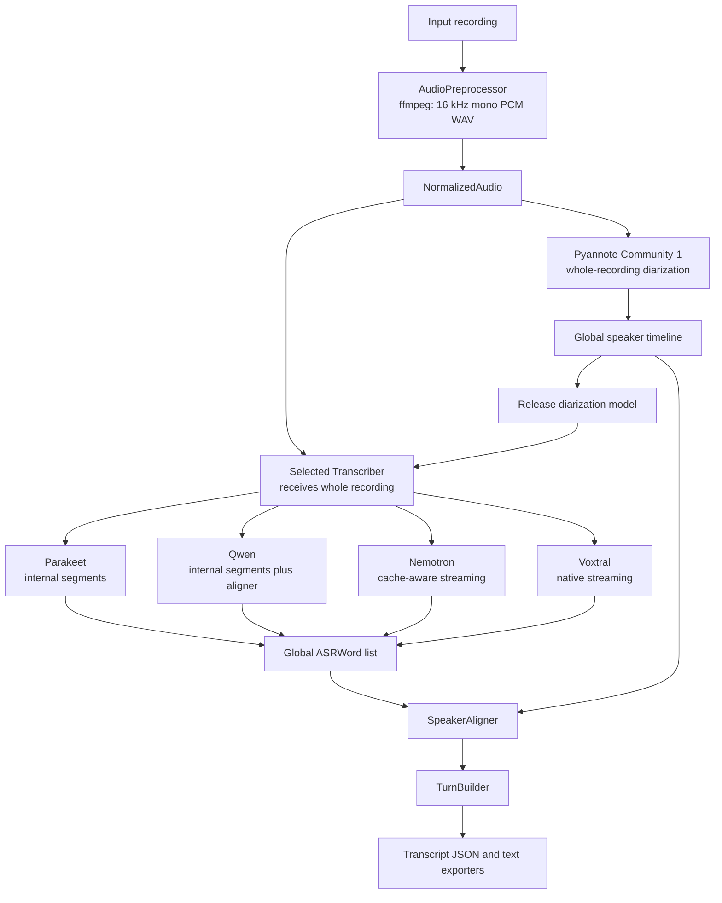

# Speech Transcription Pipeline

Local, batch-friendly speech transcription with anonymous pyannote Community-1 diarization. It has no summarization, API service, remote inference, NeMo, or vLLM dependency.

## License

This project is licensed under the [Apache License 2.0](LICENSE). Model weights are not distributed with this repository and remain subject to the licenses and terms of their respective providers.

## Architecture



Audio segmentation is not part of the generic pipeline. Each ASR backend owns its own long-form processing strategy and returns finalized, globally timestamped `ASRWord` values. Pyannote owns canonical speaker identity; ASR speaker labels are never used.

## ASR Backends

- `parakeet`: `nvidia/parakeet-tdt-0.6b-v3`. Native TDT word timestamps, punctuation, capitalization, and internal 180-second segments with 15-second overlap.
- `qwen`: `Qwen/Qwen3-ASR-1.7B-hf` plus `Qwen/Qwen3-ForcedAligner-0.6B-hf`. Qwen recognizes bounded 240-second internal segments with 15-second overlap, releases ASR, aligns all recognized segments once, then reconciles them. Collapsed 80 ms-grid boundaries are interpolated and reported in metadata. The aligner limit is 300 seconds.
- `nemotron`: `nvidia/nemotron-3.5-asr-streaming-0.6b`. Native Transformers RNNT cache-aware streaming, explicit language conditioning, native token emission timestamps, and internal token-to-word aggregation. Batch transcription defaults to 13 lookahead tokens (1.12s latency) for the model's highest-accuracy streaming configuration. It does not issue independent ASR requests for long-form audio.
- `voxtral`: `mistralai/Voxtral-Mini-4B-Realtime-2602`. Native Transformers cache-aware streaming in one continuous `generate()` session using processor-defined buffers and EOF padding. `[STREAMING_WORD]` token positions provide approximate emission-group end times; starts remain unset for speaker alignment to infer.
- Diarization: `pyannote/speaker-diarization-community-1` runs once over the normalized full recording.

Nemotron word intervals are aggregates of RNNT token emission times, not manually aligned acoustic boundaries. Leading-space tokenizer markers start words; trailing punctuation attaches to the preceding word; opening punctuation attaches to the following lexical token.

All adapters use deterministic inference, `model.eval()`, `torch.inference_mode()`, and `trust_remote_code=False`. CUDA uses FP16 on Turing-class GPUs and BF16 only when PyTorch verifies support; CPU uses FP32.

## Language

The pipeline is language-agnostic. The default ASR language is `de-DE` and can be changed with the `LANGUAGE` environment variable or the `--language` CLI flag. Qwen and Nemotron accept a locale such as `de-DE`; the Qwen ASR and forced-aligner stages use the base language code (for example `de`).

## Dependencies

| Package | Version |
| --- | --- |
| Python | `>=3.11,<3.14` |
| torch | `2.8.0` |
| torchaudio | `2.8.0` |
| torchcodec | `0.7.0` |
| transformers | `5.13.0` |
| accelerate | `1.12.0` |
| librosa | `0.11.0` |
| mistral-common | `1.10.0` with `audio` extra |
| pyannote.audio | `4.0.7` |
| numpy | `2.2.6` |

Install the appropriate PyTorch CPU/CUDA wheel first when required, then install the project:

```bash
python3.11 -m venv .venv
.venv/bin/pip install --upgrade pip
.venv/bin/pip install -e '.[dev]'
```

`ffmpeg` and `ffprobe` must be on `PATH`.

## Commands

### Local

```bash
speech-transcriber transcribe audio.m4a --asr parakeet --output ./result/parakeet --device cuda
speech-transcriber transcribe audio.m4a --asr qwen --output ./result/qwen --device cuda
speech-transcriber transcribe audio.m4a --asr nemotron --output ./result/nemotron --device cuda
speech-transcriber transcribe audio.m4a --asr voxtral --output ./result/voxtral --device cuda
```

Compare all production configurations with one normalization and one diarization pass:

```bash
speech-transcriber compare audio.m4a \
  --models parakeet,qwen,nemotron,voxtral \
  --output ./comparison --device cuda
```

Comparison executes ASR backends sequentially and releases each model before loading the next one. It does not force common segments on models with incompatible long-form behavior.

### Argo-Style Split Execution

Prepare once on a writable work volume. This normalizes the input and runs pyannote exactly once:

```bash
speech-transcriber prepare meeting.wav \
  --output /work/prepared \
  --working-directory /work/tmp \
  --device cuda
```

Run one independent ASR task for each backend using the prepared directory as a read-only input:

```bash
speech-transcriber transcribe-prepared \
  --prepared /work/prepared \
  --asr parakeet \
  --output /work/parakeet \
  --working-directory /work/tmp \
  --device cuda
```

Repeat `transcribe-prepared` with `qwen`, `nemotron`, or `voxtral`. The command does not
normalize audio or initialize pyannote, and it never removes or modifies the prepared input.
Argo Workflows should transfer `/work/prepared` and each backend result through its configured
artifact repository; the application only reads and writes local filesystem paths.

### Backend Configuration

CLI values override environment values, which override defaults.

```text
ASR_BACKEND
ASR_MODEL
QWEN_ALIGNER_MODEL
PYANNOTE_MODEL
PARAKEET_SEGMENT_DURATION
PARAKEET_SEGMENT_OVERLAP
QWEN_SEGMENT_DURATION
QWEN_SEGMENT_OVERLAP
NEMOTRON_NUM_LOOKAHEAD_TOKENS
VOXTRAL_DELAY_MS
VOXTRAL_TIMESTAMP_OFFSET_TOKENS
LANGUAGE
DEVICE
WORKING_DIRECTORY
NUM_SPEAKERS
MIN_SPEAKERS
MAX_SPEAKERS
KEEP_INTERMEDIATE_FILES
LOG_LEVEL
HF_HOME
HF_TOKEN
```

Equivalent CLI flags include `--parakeet-segment-duration`, `--qwen-segment-duration`, and `--nemotron-num-lookahead-tokens`. There is intentionally no global `--chunk-duration` or `CHUNK_DURATION`: those old settings were removed because they incorrectly coupled backend implementations.

Nemotron validates an explicit lookahead through the loaded processor. Batch transcription defaults to 13 lookahead tokens; set `NEMOTRON_NUM_LOOKAHEAD_TOKENS` or `--nemotron-num-lookahead-tokens` to select another supported latency/accuracy trade-off. The checkpoint derives its first/subsequent streaming buffer sizes and latency from model/processor configuration.

Voxtral derives its first/subsequent buffers, transcript delay, and right EOF padding from the loaded processor. Its marker-derived end times are approximate, and multiple lexical words may share one native emission-group end time.

## Output and Metrics

`OUTPUT/transcript.json` is the canonical versioned output. Its word timestamps are seconds from the beginning of the normalized recording and are compatible with the pyannote timeline.

```text
comparison/
├── diarization.json
├── metadata.json
├── parakeet/
│   ├── asr_words.json
│   ├── metadata.json
│   ├── transcript.json
│   └── transcript.txt
├── qwen/
├── nemotron/
└── voxtral/
```

Each backend metadata file records model/device/dtype, load time, ASR time, total backend time, RTF, peak CUDA memory, backend configuration, and backend-specific metrics. Forced-alignment backends record recognition, recognizer release, aligner load, alignment, and aligner release timings; Qwen also records interpolated timestamps plus clipped/dropped trailing-boundary words and their maximum overflow. Nemotron records language, lookahead, streaming latency, and `stream_buffers_processed`; Voxtral records native delay, right padding, stream buffer counts, and any `inferred_final_emission_groups` used for an unmarked EOF tail.

With `--keep-intermediate`, generic diarization, ASR words, and attributed words are retained under `OUTPUT/intermediate`. Backend-specific state remains internal and is never added to the canonical transcript schema.

### Worker Artifact Contracts

The worker pipeline has three filesystem boundaries: `prepare`, backend-specific recognition, and
backend-neutral finalization. JSON/files are the cross-container and Argo interoperability contract.
The Python `Transcriber` protocol is only an internal abstraction for the current Python-native ASR
implementations; a future vLLM, NVIDIA NIM, Riva, or Triton runtime only needs to produce the same
recognition artifact and does not need to import or implement that protocol.

`prepare` writes a versioned prepared artifact containing only these files:

```text
prepared/
├── normalized.wav
├── diarization.json
└── prepared.json
```

`normalized.wav` is 16 kHz mono 16-bit PCM WAV. `diarization.json` contains the canonical
`DiarizationSegment` records. `prepared.json` has `schema_version: 1`, relative filenames,
normalized audio metadata, diarization model provenance, and language. It contains no absolute
host paths.

Each backend-specific `recognize-prepared` task writes a versioned ASR artifact:

```text
asr/
├── asr_words.json
└── metadata.json
```

`asr_words.json` contains only backend-neutral `ASRWord` records (`text`, absolute `end`, nullable
absolute `start`, and nullable `confidence`). It never contains speaker attribution, turns,
pyannote output, backend objects, or absolute paths. `metadata.json` has `schema_version: 1`, the
relative ASR-word filename, backend/model/device/dtype, timings, RTF, peak GPU memory, backend
metrics/model references/configuration, and generic runtime provenance (`runtime.name`,
`runtime.version`, and `runtime.components`). Absolute model paths are reduced to their basename.

`finalize-prepared` needs only `prepared/` and `asr/`; it does not instantiate an ASR backend or
load model weights. It performs speaker alignment, turn building, and transcript export, preserving
the ASR metadata in the final result:

```text
result/
├── transcript.json
├── transcript.txt
├── asr_words.json
└── metadata.json
```

`transcript.json` is the existing canonical transcript schema. `asr_words.json` contains the
backend-neutral `ASRWord` records. `metadata.json` is the versioned ASR metadata copied from the
recognition artifact.

For local convenience, `transcribe-prepared` still composes recognition and finalization in one
process. The independently runnable commands are:

```bash
speech-transcriber recognize-prepared --prepared /work/prepared --asr parakeet --output /work/asr --device cuda
speech-transcriber finalize-prepared --prepared /work/prepared --asr-result /work/asr --output /work/result
```

## Offline and Air-Gapped Models

On an approved connected staging system, prefetch artifacts:

```bash
HF_TOKEN=hf_... speech-transcriber prefetch-models --asr parakeet
HF_TOKEN=hf_... speech-transcriber prefetch-models --asr qwen
HF_TOKEN=hf_... speech-transcriber prefetch-models --asr nemotron
HF_TOKEN=hf_... speech-transcriber prefetch-models --asr voxtral
```

Qwen prefetch includes the configured Qwen forced-aligner artifact.

Also obtain the accepted pyannote artifact through the approved process. Transfer approved artifacts and externally generated checksums through the air gap. A production volume can use:

```text
/models/
├── pyannote-community-1/
├── parakeet-tdt-0.6b-v3/
├── qwen3-asr-1.7b/
├── qwen3-forced-aligner-0.6b/
├── nemotron-3.5-asr-streaming-0.6b/
└── voxtral-mini-4b-realtime-2602/
```

Run with mounted local paths and no runtime network access:

```bash
HF_HUB_OFFLINE=1 \
TRANSFORMERS_OFFLINE=1 \
ASR_BACKEND=nemotron \
ASR_MODEL=/models/nemotron-3.5-asr-streaming-0.6b \
PYANNOTE_MODEL=/models/pyannote-community-1 \
speech-transcriber transcribe /data/audio.m4a --output /data/result --device cuda
```

With all required artifacts mounted locally, inference performs no network access, telemetry, NVIDIA API calls, or remote-code loading.

## Podman and Kubernetes

Build the single non-root, arbitrary-UID compatible image:

```bash
podman build -t speech-transcriber:local -f Containerfile .
```

```bash
podman run --rm --device nvidia.com/gpu=all \
  --userns=keep-id --user "$(id -u):$(id -g)" \
  -e HF_HUB_OFFLINE=1 -e TRANSFORMERS_OFFLINE=1 \
  -e ASR_BACKEND=nemotron \
  -e ASR_MODEL=/models/nemotron-3.5-asr-streaming-0.6b \
  -e PYANNOTE_MODEL=/models/pyannote-community-1 \
  -v "$PWD/input:/input:ro,Z" -v "$PWD/result:/output:Z" \
  -v "$PWD/work:/work:Z" -v "$PWD/models:/models:ro,Z" \
  speech-transcriber:local transcribe /input/audio.m4a \
  --output /output --working-directory /work --device cuda
```

`deploy/k8s/job.example.yaml` is a generic `batch/v1` Job that requests one GPU and demonstrates the same mounted-local-model offline mode on any Kubernetes cluster. No model weights or secrets are baked into the image.

`deploy/argo/transcription-workflowtemplate.yaml` is an example Argo `WorkflowTemplate`. It uses
one lightweight `validate-backends` task before a GPU-limited `prepare` task. It then fans out one
GPU-limited `recognize-prepared`, common CPU-only finalization, and non-GPU `publish` chain for
every selected backend. Each backend has an explicit recognition template and image parameter (`parakeet_image`, `qwen_image`,
`nemotron_image`, and `voxtral_image`), so a future backend-specific runtime can replace its image
and command as long as it produces the ASR artifact, without changing the fan-out DAG. All four currently default to the pinned worker image
`ghcr.io/balex42/transcription-pipeline:sha-b6b6d90`.

`backends` must be a JSON array containing only `parakeet`, `qwen`, `nemotron`, or `voxtral`.
The pre-prepare validator rejects malformed or empty arrays, unsupported names, and duplicates, then
emits one boolean output per backend to condition the four direct DAG branches. A comma-separated
value is invalid and fails before normalization, diarization, or any ASR command runs. Select one
backend:

```bash
argo submit --from workflowtemplate/speech-transcription --namespace argo \
  -p 'backends=["parakeet"]' -a recording=/path/to/recording.m4a
```

Select multiple backends:

```bash
argo submit --from workflowtemplate/speech-transcription --namespace argo \
  -p 'backends=["parakeet","qwen","nemotron"]' \
  -a recording=/path/to/recording.m4a
```

The top-level DAG is `validate-backends`, then `prepare` once and `publish-source` once, followed
by direct `recognize-parakeet`, `recognize-qwen`, `recognize-nemotron`, and `recognize-voxtral`
branches when selected. Each selected branch is `recognize` (GPU), `finalize` (CPU), then `publish`
(CPU); there are no backend dispatcher or pipeline wrapper nodes. `publish-source` is CPU-only,
does not need prepared audio, and intentionally runs in parallel with `prepare` after validation.
Each recognition task requests one GPU and invokes its fixed backend name, so with two available
GPUs two ASR tasks can run concurrently while additional selected backends wait for Kubernetes scheduling.
The workflow adds no inter-backend dependencies, mutexes, semaphores, or parallelism limits. No pod
loads multiple ASR models.

The default Argo artifact repository stores temporary prepared, ASR, and final-result artifacts in
the `argo-artifacts` bucket at `runs/<workflow-uid>/prepared/`, `runs/<workflow-uid>/asr/<backend>/`,
and `runs/<workflow-uid>/result/<backend>/`. Durable outputs explicitly use the separate
`transcription-data` bucket:

```text
jobs/<workflow-uid>/
  source/recording
  parakeet/transcript.json
  parakeet/transcript.txt
  parakeet/asr_words.json
  parakeet/metadata.json
  qwen/...
  nemotron/...
  voxtral/...
```

The source recording is published once per workflow; backend publication tasks only copy their own
four result files from a non-overlapping input directory. Durable artifact outputs explicitly use
the RustFS service endpoint and the existing `rustfs-s3` Secret, rather than inheriting the default
`argo-artifacts` connection. `utility_image` defaults to the lightweight `python:3.11-alpine` image
for JSON validation and file-copy tasks. Production or air-gapped deployments should mirror and pin
that utility image in their internal registry.

Only `prepare` and the four recognition templates declare and mount `speech-model-cache` read-only
at `/models`; validation, finalization, and publication pods do not depend on model storage.
A ReadWriteOnce PVC can be mounted by multiple pods on the same node, so it does not require serializing backend GPU pods.
If selected backend pods must run on different nodes, an RWO volume may prevent multi-node cache
attachment; use RWX or per-node caches if that becomes a scheduling constraint. The PVC and its
storage class are configured outside this repository. Retention of durable prefixes is controlled
by the RustFS bucket lifecycle policy.

## Verification

Normal tests download no models and require no GPU:

```bash
uv run pytest
uv run ruff check .
uv run mypy src/speech_transcriber
```

An optional real-model smoke test requires predownloaded local artifacts, a WAV, and `RUN_MODEL_TESTS=1 MODEL_TEST_BACKEND=nemotron MODEL_TEST_AUDIO=/path/to/audio.wav uv run pytest tests/integration`.
