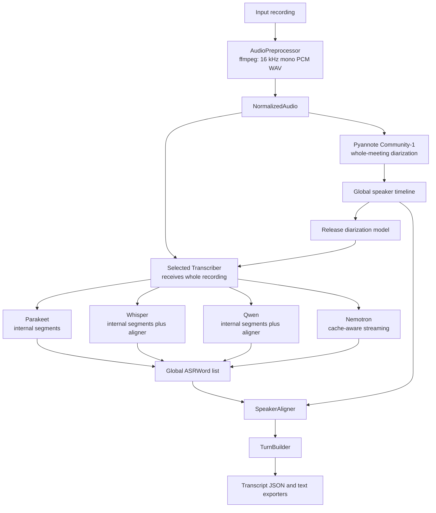

# German Meeting Transcriber

Local, batch-friendly German meeting transcription with anonymous pyannote Community-1 diarization. It has no summarization, API service, remote inference, NeMo, or vLLM dependency.

## Architecture



Audio segmentation is not part of the generic pipeline. Each ASR backend owns its own long-form processing strategy and returns finalized, globally timestamped `ASRWord` values. Pyannote owns canonical speaker identity; ASR speaker labels are never used.

## ASR Backends

- `parakeet`: `nvidia/parakeet-tdt-0.6b-v3`. Native TDT word timestamps, punctuation, capitalization, and internal 180-second segments with 15-second overlap.
- `whisper`: `openai/whisper-large-v3` plus `Qwen/Qwen3-ForcedAligner-0.6B-hf`. Whisper recognizes German `task=transcribe` text in native 30-second windows with 5-second overlap, releases Whisper, then uses the reusable forced aligner for word timestamps and reconciles overlap boundaries.
- `qwen`: `Qwen/Qwen3-ASR-1.7B-hf` plus `Qwen/Qwen3-ForcedAligner-0.6B-hf`. Qwen recognizes bounded 240-second internal segments with 15-second overlap, releases ASR, aligns all recognized segments once, then reconciles them. The aligner limit is 300 seconds.
- `nemotron`: `nvidia/nemotron-3.5-asr-streaming-0.6b`. Native Transformers RNNT cache-aware streaming, explicit `de-DE` conditioning, native token emission timestamps, and internal token-to-word aggregation. It does not issue independent ASR requests for long-form audio.
- Diarization: `pyannote/speaker-diarization-community-1` runs once over the normalized full meeting.

Nemotron word intervals are aggregates of RNNT token emission times, not manually aligned acoustic boundaries. Leading-space tokenizer markers start words; trailing punctuation attaches to the preceding word; opening punctuation attaches to the following lexical token.

All adapters use deterministic inference, `model.eval()`, `torch.inference_mode()`, and `trust_remote_code=False`. CUDA uses FP16 on Turing-class GPUs and BF16 only when PyTorch verifies support; CPU uses FP32.

## Dependencies

| Package | Version |
| --- | --- |
| Python | `>=3.11,<3.14` |
| torch | `2.8.0` |
| torchaudio | `2.8.0` |
| torchcodec | `0.7.0` |
| transformers | `5.13.0` |
| accelerate | `1.12.0` |
| librosa | `0.11.0` |
| pyannote.audio | `4.0.7` |
| numpy | `2.2.6` |

Install the appropriate PyTorch CPU/CUDA wheel first when required, then install the project:

```bash
python3.11 -m venv .venv
.venv/bin/pip install --upgrade pip
.venv/bin/pip install -e '.[dev]'
```

`ffmpeg` and `ffprobe` must be on `PATH`.

## Commands

```bash
meeting-transcriber transcribe meeting.m4a --asr parakeet --output ./result/parakeet --device cuda
meeting-transcriber transcribe meeting.m4a --asr whisper --output ./result/whisper --device cuda
meeting-transcriber transcribe meeting.m4a --asr qwen --output ./result/qwen --device cuda
meeting-transcriber transcribe meeting.m4a --asr nemotron --output ./result/nemotron --device cuda
```

Compare all production configurations with one normalization and one diarization pass:

```bash
meeting-transcriber compare meeting.m4a \
  --models parakeet,whisper,qwen,nemotron \
  --output ./comparison --device cuda
```

Comparison executes ASR backends sequentially and releases each model before loading the next one. It does not force common segments on models with incompatible long-form behavior.

### Backend Configuration

CLI values override environment values, which override defaults.

```text
ASR_BACKEND
ASR_MODEL
QWEN_ALIGNER_MODEL
PYANNOTE_MODEL
PARAKEET_SEGMENT_DURATION
PARAKEET_SEGMENT_OVERLAP
QWEN_SEGMENT_DURATION
QWEN_SEGMENT_OVERLAP
NEMOTRON_NUM_LOOKAHEAD_TOKENS
LANGUAGE
DEVICE
WORKING_DIRECTORY
NUM_SPEAKERS
MIN_SPEAKERS
MAX_SPEAKERS
KEEP_INTERMEDIATE_FILES
LOG_LEVEL
HF_HOME
HF_TOKEN
```

Equivalent CLI flags include `--parakeet-segment-duration`, `--qwen-segment-duration`, and `--nemotron-num-lookahead-tokens`. Whisper does not expose a segment setting: its segment duration is fixed to the model's native 30-second window with 5-second overlap. There is intentionally no global `--chunk-duration` or `CHUNK_DURATION`: those old settings were removed because they incorrectly coupled backend implementations.

Nemotron validates an explicit lookahead through the loaded processor. The checkpoint advertises its supported lookahead values and derives its first/subsequent streaming buffer sizes and latency from model/processor configuration.

## Output and Metrics

`OUTPUT/transcript.json` is the canonical versioned output. Its word timestamps are seconds from the beginning of the normalized meeting and are compatible with the pyannote timeline.

```text
comparison/
├── diarization.json
├── metadata.json
├── parakeet/
│   ├── asr_words.json
│   ├── metadata.json
│   ├── transcript.json
│   └── transcript.txt
├── whisper/
├── qwen/
└── nemotron/
```

Each backend metadata file records model/device/dtype, load time, ASR time, total backend time, RTF, peak CUDA memory, backend configuration, and backend-specific metrics. Forced-alignment backends record recognition, recognizer release, aligner load, alignment, and aligner release timings. Nemotron records language, lookahead, streaming latency, and `stream_buffers_processed`.

With `--keep-intermediate`, generic diarization, ASR words, and attributed words are retained under `OUTPUT/intermediate`. Backend-specific state remains internal and is never added to the canonical transcript schema.

## Offline and Air-Gapped Models

On an approved connected staging system, prefetch artifacts:

```bash
HF_TOKEN=hf_... meeting-transcriber prefetch-models --asr parakeet
HF_TOKEN=hf_... meeting-transcriber prefetch-models --asr whisper
HF_TOKEN=hf_... meeting-transcriber prefetch-models --asr qwen
HF_TOKEN=hf_... meeting-transcriber prefetch-models --asr nemotron
```

Whisper and Qwen prefetch commands both include the configured Qwen forced-aligner artifact.

Also obtain the accepted pyannote artifact through the approved process. Transfer approved artifacts and externally generated checksums through the air gap. A production volume can use:

```text
/models/
├── pyannote-community-1/
├── parakeet-tdt-0.6b-v3/
├── whisper-large-v3/
├── qwen3-asr-1.7b/
├── qwen3-forced-aligner-0.6b/
└── nemotron-3.5-asr-streaming-0.6b/
```

Run with mounted local paths and no runtime network access:

```bash
HF_HUB_OFFLINE=1 \
TRANSFORMERS_OFFLINE=1 \
ASR_BACKEND=nemotron \
ASR_MODEL=/models/nemotron-3.5-asr-streaming-0.6b \
PYANNOTE_MODEL=/models/pyannote-community-1 \
meeting-transcriber transcribe /data/meeting.m4a --output /data/result --device cuda
```

With all required artifacts mounted locally, inference performs no network access, telemetry, NVIDIA API calls, or remote-code loading.

## Podman and OpenShift

Build the single non-root, arbitrary-UID compatible image:

```bash
podman build -t meeting-transcriber:local -f Containerfile .
```

```bash
podman run --rm --device nvidia.com/gpu=all \
  --userns=keep-id --user "$(id -u):$(id -g)" \
  -e HF_HUB_OFFLINE=1 -e TRANSFORMERS_OFFLINE=1 \
  -e ASR_BACKEND=nemotron \
  -e ASR_MODEL=/models/nemotron-3.5-asr-streaming-0.6b \
  -e PYANNOTE_MODEL=/models/pyannote-community-1 \
  -v "$PWD/input:/input:ro,Z" -v "$PWD/result:/output:Z" \
  -v "$PWD/work:/work:Z" -v "$PWD/models:/models:ro,Z" \
  meeting-transcriber:local transcribe /input/meeting.m4a \
  --output /output --working-directory /work --device cuda
```

`deploy/openshift/job.example.yaml` requests one GPU and demonstrates the same mounted-local-model offline model. No model weights or secrets are baked into the image.

## Verification

Normal tests download no models and require no GPU:

```bash
uv run pytest
uv run ruff check .
uv run mypy src/meeting_transcriber
```

An optional real-model smoke test requires predownloaded local artifacts, a German WAV, and `RUN_MODEL_TESTS=1 MODEL_TEST_BACKEND=nemotron MODEL_TEST_AUDIO=/path/to/audio.wav uv run pytest tests/integration`.
