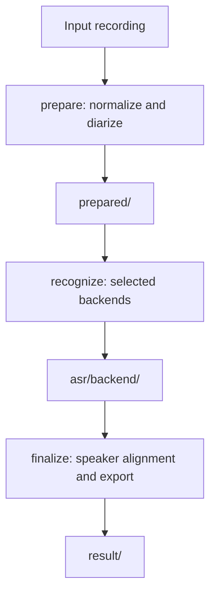

# Speech transcription pipeline

This project runs local, speaker-attributed speech transcription through Argo Workflows. One
`prepare` worker normalizes and diarizes the recording, selected `recognize` workers run in
parallel, and backend-neutral `finalize` workers build the transcripts.

The public CLI has exactly four commands:

```text
prepare
recognize
finalize
prefetch
```

The CLI runs workers and supports local debugging. Argo owns orchestration. The project has no API
service, summarization step, remote inference, or vLLM dependency. Model weights are not included.

## Architecture



Workers communicate through files, not Python objects. The `prepared/`, `asr/`, and `result/`
formats are the cross-container contract. A different runtime can replace an implementation if it
produces the same artifacts.

The current runtime mapping is:

| Runtime | Backends and stages | Image source |
| --- | --- | --- |
| Transformers | `qwen`, `nemotron`, `voxtral`, `prepare`, `finalize` | `Containerfile.transformers` |
| NeMo | `parakeet`, `primeline`, `canary` | `Containerfile.nemo` |
| CTranslate2 | `faster-whisper` | `Containerfile.ctranslate2` |

`BACKEND_RUNTIMES` in `src/speech_transcriber/config.py` is authoritative. Backend names are part
of the application contract; runtime names are deployment details.

Preparation runs pyannote Community-1 once over the full normalized recording. Pyannote supplies
the canonical anonymous speaker labels. ASR speaker labels are not used. Each ASR adapter owns its
long-recording strategy and returns globally timed `ASRWord` records. Finalization runs on CPU and
does not load ASR or diarization models.

## Backends

| Backend | Model | Processing and timestamps |
| --- | --- | --- |
| `parakeet` | `nvidia/parakeet-tdt-0.6b-v3` | NeMo `.nemo` checkpoint, native word timestamps, punctuation and capitalization. Uses 180-second segments with 15-second overlap. No forced alignment. |
| `primeline` | `primeline/parakeet-primeline` | German-focused NeMo FastConformer TDT checkpoint (`2_95_WER.nemo`). Uses the same 180-second segments with 15-second overlap as Parakeet, with native words, no forced alignment, and nullable confidence. |
| `qwen` | `Qwen/Qwen3-ASR-1.7B-hf` and `Qwen/Qwen3-ForcedAligner-0.6B-hf` | Recognizes 240-second segments with 15-second overlap. The recognizer is released before the aligner is loaded. The aligner handles each recognized segment, then the adapter reconciles results. The aligner limit is 300 seconds. |
| `nemotron` | `nvidia/nemotron-3.5-asr-streaming-0.6b` | Transformers RNNT in one cache-aware stream. Uses explicit language conditioning and native token emission times. Defaults to 13 lookahead tokens, which the model documents as 1.12 seconds of latency. |
| `voxtral` | `mistralai/Voxtral-Mini-4B-Realtime-2602` | One cache-aware `generate()` session with processor-defined buffers and EOF padding. `[STREAMING_WORD]` positions provide approximate emission-group end times. Word starts remain unset for finalization to infer. |
| `faster-whisper` | `Systran/faster-whisper-large-v3` | Native faster-whisper and CTranslate2, not Transformers. Uses native word bounds and probabilities, `float16` compute by default, beam size 5, and no VAD or forced alignment. |
| `canary` | `nvidia/canary-1b-v2` | NeMo checkpoint (`canary-1b-v2.nemo`, CC BY 4.0). Uses deterministic, non-overlapping 10-second PCM chunks, one model load, sequential inference, and recording-global native word timestamps. Confidence is null. |

Qwen repairs collapsed boundaries on the model's 80 ms grid and records clipped or dropped trailing
boundary words in metadata. Nemotron word intervals aggregate RNNT token emissions; they are not
manually aligned acoustic boundaries. Leading-space markers start words, trailing punctuation joins
the previous word without extending its lexical end, and opening punctuation joins the next word.
Voxtral end times may be shared by several words in one emission group.

Canary computes chunk boundaries from audio frames:
`frames_per_chunk = round(chunk_duration * 16000)`. It rebases each native local timestamp by
`chunk_start_frame / sample_rate`. Short recordings use the same path with one short chunk. Chunk
boundaries never depend on diarization. Source and target language are the same, so the adapter does
not request translation or manually deduplicate timestamps.

Transformers adapters use deterministic inference, `model.eval()`, `torch.inference_mode()`, and
`trust_remote_code=False`. CUDA uses BF16 only when PyTorch reports support and otherwise uses FP16;
CPU uses FP32. NeMo checkpoints control their own precision and report
`dtype_name=checkpoint-default`. CTranslate2 uses the configured faster-whisper compute type and
does not import Transformers or Torch for inference.

## Language

The workflow language has one path:

```text
Argo language parameter
    -> prepare --language
    -> prepared.json
    -> every recognize worker
    -> finalize
```

The Argo parameter defaults to `de-DE`. Local preparation can use `--language` or `LANGUAGE`.
`PreparedRecording.language` is required, and `prepared.json` is the only inter-stage language
source. Recognition passes that value to the selected adapter; finalization copies it to the
transcript. Neither `recognize` nor `finalize` has a language flag or reads `LANGUAGE`.

Qwen and faster-whisper reduce a locale such as `de-DE` to its base code. Canary performs the same
reduction, validates the supported code, and records the requested, source, and target values.
Nemotron receives the concrete prepared locale. The faster-whisper adapter still has native
language detection support internally, but the production worker always supplies the prepared
language.

## Installation

| Package | Version |
| --- | --- |
| Python | `>=3.11,<3.14` |
| torch | `2.8.0` |
| torchaudio | `2.8.0` |
| torchcodec | `0.7.0` |
| transformers | `5.13.0` |
| accelerate | `1.12.0` |
| librosa | `0.11.0` |
| mistral-common | `1.10.0` with `audio` extra |
| pyannote.audio | `4.0.7` |
| numpy | `2.2.6` |
| faster-whisper | `1.2.1` in `runtimes/ctranslate2/uv.lock` |
| CTranslate2 | `4.8.1` in `runtimes/ctranslate2/uv.lock` |
| NVIDIA NeMo Speech | `3.0.0` with the `asr` extra in `runtimes/nemo/uv.lock` |
| NeMo base runtime | Python 3.12, PyTorch `2.12.0+cu132`, CUDA 13.2, cuDNN 9 |

Install the appropriate CPU or CUDA PyTorch wheel first when needed, then install the development
environment:

```bash
python3.11 -m venv .venv
.venv/bin/pip install --upgrade pip
.venv/bin/pip install -e '.[dev]'
```

`ffmpeg` and `ffprobe` must be on `PATH`.

The root project and `uv.lock` own the Transformers runtime and development tools.
`runtimes/nemo/` and `runtimes/ctranslate2/` own their runtime dependencies. Those images install
the shared project with `--no-deps`. The NeMo lock uses released `nemo-toolkit[asr]==3.0.0`, not the
`cu13` extra or an installation from NeMo `main`. The base image owns its Torch and CUDA packages,
so the image excludes the lock's transitive Torch and CUDA subtree.

## Configuration

Configuration precedence is:

```text
explicit CLI option -> owning environment variable -> default
```

Each stage reads only its own environment. A malformed variable for another stage or backend is
ignored. For example, `VOXTRAL_DELAY_MS=garbage` does not break Parakeet. Explicit CLI options are
operator intent, so `--backend parakeet --voxtral-delay-ms 480` is rejected.

| Stage | Environment variables |
| --- | --- |
| `prepare` | `WORKING_DIRECTORY`, `DEVICE`, `PYANNOTE_MODEL`, `LANGUAGE`, `NUM_SPEAKERS`, `MIN_SPEAKERS`, `MAX_SPEAKERS`, `KEEP_INTERMEDIATE_FILES` |
| `recognize` | `WORKING_DIRECTORY`, `DEVICE`, `ASR_MODEL`, plus only the selected backend's variables below |
| `finalize` | `KEEP_INTERMEDIATE_FILES` |

| Backend | Owned environment variables | Owned CLI options | Defaults |
| --- | --- | --- | --- |
| Parakeet | `PARAKEET_SEGMENT_DURATION`, `PARAKEET_SEGMENT_OVERLAP` | `--parakeet-segment-duration`, `--parakeet-segment-overlap` | 180 seconds, 15 seconds |
| Primeline | none | none | model defaults only |
| Qwen | `QWEN_ALIGNER_MODEL`, `QWEN_SEGMENT_DURATION`, `QWEN_SEGMENT_OVERLAP` | `--qwen-aligner-model`, `--qwen-segment-duration`, `--qwen-segment-overlap` | configured aligner, 240 seconds, 15 seconds |
| Nemotron | `NEMOTRON_NUM_LOOKAHEAD_TOKENS` | `--nemotron-num-lookahead-tokens` | 13 tokens |
| Voxtral | `VOXTRAL_DELAY_MS`, `VOXTRAL_TIMESTAMP_OFFSET_TOKENS` | `--voxtral-delay-ms`, `--voxtral-timestamp-offset-tokens` | 2400 ms, 4 tokens |
| faster-whisper | `FASTER_WHISPER_COMPUTE_TYPE` | `--faster-whisper-compute-type` | `float16` |
| Canary | `CANARY_CHUNK_DURATION` | `--canary-chunk-duration` | 10 seconds |

`--model` is common to every backend. `--backend` is required; there is no `ASR_BACKEND`
environment fallback or default backend. There is no global `CHUNK_DURATION` or `--chunk-duration`.

Qwen segment duration may not exceed 300 seconds. Voxtral delay accepts 80 ms steps through 1200
ms or exactly 2400 ms; its timestamp offset accepts 0 through 30 tokens. Faster-whisper accepts
`float16`, `bfloat16`, `float32`, `int8`, and `int8_float16`. Nemotron asks the loaded processor to
validate an explicit lookahead value.

Logging is process configuration, not stage configuration. Every command resolves one level:

```text
--log-level -> LOG_LEVEL -> INFO
```

Supported levels are `DEBUG`, `INFO`, `WARNING`, and `ERROR`. An invalid `LOG_LEVEL` fails before
worker setup. Argo sets `HF_HUB_OFFLINE=1` and `TRANSFORMERS_OFFLINE=1` for all recognition pods.
CTranslate2 does not read `TRANSFORMERS_OFFLINE`, so the shared setting is harmless there.

## Artifact contracts

### Prepared artifact

`prepare` writes:

```text
prepared/
|-- normalized.wav
|-- diarization.json
`-- prepared.json
```

`normalized.wav` is 16 kHz, mono, 16-bit PCM WAV. `diarization.json` contains canonical
`DiarizationSegment` records. `prepared.json` uses schema version 2 and stores audio metadata, the
SHA-256 digest of `normalized.wav`, language, and diarization model provenance. Loading verifies the
digest and the audio format.

`audio.file`, `audio.source`, and `diarization.file` must be portable relative filenames. The
`diarization.model` field is inert provenance and may be a Hugging Face repository ID or an
absolute local model path such as `/models/pyannote-community-1`. The loader preserves that string
and never dereferences it.

### Recognition artifact

Each selected backend writes:

```text
asr/
|-- asr_words.json
`-- metadata.json
```

`asr_words.json` contains backend-neutral `ASRWord` records: `text`, absolute `end`, nullable
absolute `start`, and nullable `confidence`. It contains no speaker attribution, turns, pyannote
output, backend objects, or absolute paths.

`metadata.json` uses schema version 2. It stores the relative words filename, prepared-audio
SHA-256, backend, model, device, dtype, audio duration, model load time, ASR time, total time, RTF,
peak CUDA memory, backend configuration and metrics, model references, and runtime provenance.
Finite signed metrics such as log probabilities are valid. External metadata with absolute paths is
rejected.

`RecognitionRunner` owns loading, timing, release, RTF, audio SHA propagation, runtime provenance,
and metadata collection. It remains backend-neutral and does not import PyTorch, Transformers,
pyannote, normalization code, or adapter implementations. The CLI adds Torch CUDA memory metrics
when Torch is available; CTranslate2 records no Torch memory value.

### Final result

`finalize` reads only `prepared/` and `asr/`. Before speaker alignment, it checks the expected
backend, audio duration, and normalized-audio SHA-256. It does not instantiate an ASR backend or
load model weights.

```text
result/
|-- transcript.json
|-- transcript.txt
|-- asr_words.json
`-- metadata.json
```

`transcript.json` is the canonical versioned transcript. Word times are seconds from the start of
the normalized recording and use the same timeline as pyannote. `asr_words.json` and
`metadata.json` preserve the recognition artifact. Finalization imports only artifact contracts,
speaker alignment, turn building, and exporters.

Shared metadata covers model, device, dtype, timings, RTF, peak memory, configuration, and runtime
versions. Qwen also records alignment timings, repaired timestamps, and boundary clipping. Nemotron
records language, lookahead, streaming latency, and processed buffers. Voxtral records delay,
padding, stream buffers, and inferred final emission groups. Faster-whisper records its resolved
model path and detected language data. Canary records its checkpoint, chunk mode and count,
languages, word count, and NeMo/PyTorch/CUDA versions. Parakeet and Primeline record checkpoint and
snapshot revisions when loaded from the Hugging Face cache.

`KEEP_INTERMEDIATE_FILES=1` retains preparation work and writes diarization, ASR words, and
speaker-attributed words under `OUTPUT/intermediate`. Backend-specific internal state is not added
to the transcript schema.

## Offline models

Run `prefetch` on an approved connected staging system:

```bash
HF_TOKEN=hf_... speech-transcriber prefetch --backend parakeet
HF_TOKEN=hf_... speech-transcriber prefetch --backend primeline
HF_TOKEN=hf_... speech-transcriber prefetch --backend qwen
HF_TOKEN=hf_... speech-transcriber prefetch --backend nemotron
HF_TOKEN=hf_... speech-transcriber prefetch --backend voxtral
HF_TOKEN=hf_... speech-transcriber prefetch --backend faster-whisper
HF_TOKEN=hf_... speech-transcriber prefetch --backend canary
```

Every prefetch also downloads pyannote, which requires accepted access conditions and `HF_TOKEN`
when the repository is gated. Qwen also downloads its forced aligner. The faster-whisper repository
already contains the tokenizer and preprocessing files needed by CTranslate2; no runtime conversion
from Transformers format occurs.

The NeMo repositories must contain `parakeet-tdt-0.6b-v3.nemo`, `2_95_WER.nemo`, or
`canary-1b-v2.nemo` as appropriate. Canary's timestamp alignment component must remain in the
checkpoint. These backends restore the local files with `ASRModel.restore_from()`.

NeMo, Voxtral, and faster-whisper use the shared offline snapshot resolver. A repository ID maps to
`$HF_HOME/hub/models--<org>--<name>/`. `refs/main` selects the active snapshot. If that ref is
missing, exactly one cached snapshot is accepted; missing or ambiguous caches fail instead of
guessing. Qwen and Nemotron load through Transformers with `trust_remote_code=False` and obey the
Hugging Face offline settings. Existing absolute model paths bypass the cache layout.

Transfer approved model files and externally generated checksums through the air gap. One possible
volume layout is:

```text
/models/
|-- pyannote-community-1/
|-- parakeet-tdt-0.6b-v3/
|-- parakeet-primeline/
|-- qwen3-asr-1.7b/
|-- qwen3-forced-aligner-0.6b/
|-- nemotron-3.5-asr-streaming-0.6b/
|-- voxtral-mini-4b-realtime-2602/
|-- faster-whisper-large-v3/
`-- canary-1b-v2/
```

Preparation can use an absolute local pyannote path:

```bash
HF_HUB_OFFLINE=1 \
TRANSFORMERS_OFFLINE=1 \
PYANNOTE_MODEL=/models/pyannote-community-1 \
speech-transcriber prepare /data/audio.m4a --output /data/prepared --device cuda
```

The exact `PYANNOTE_MODEL` value is stored as `diarization.model` provenance in `prepared.json`.
With all artifacts staged and offline flags set, inference performs no network access, telemetry,
NVIDIA API calls, or remote-code loading. CTranslate2 reads its snapshot directly from the
read-only cache without copying it into ephemeral storage. A missing offline model produces an
explicit cache error rather than an online lookup.

## Containers

Build the three images with Podman:

```bash
podman build -t speech-transcriber-transformers:local -f Containerfile.transformers .
podman build -t speech-transcriber-nemo:local -f Containerfile.nemo .
podman build -t speech-transcriber-ctranslate2:local -f Containerfile.ctranslate2 .
```

The CTranslate2 image uses `nvidia/cuda:12.6.3-cudnn-runtime-ubuntu24.04` and installs only its
locked CTranslate2 stack plus shared artifact code. The NeMo image uses
`pytorch/pytorch:2.12.0-cuda13.2-cudnn9-runtime`, keeps the base image's PyTorch/CUDA/cuDNN, and
installs the remaining hash-locked NeMo packages. It contains Parakeet, Primeline, and Canary, but
not pyannote, faster-whisper, or CTranslate2.

All images support arbitrary non-root UIDs through `container/uid-entrypoint.sh`. For an unknown
UID or GID, the entrypoint copies `/etc/passwd` and `/etc/group` to unique files under `/tmp` (or
`NSS_WRAPPER_TMPDIR`), adds the runtime identity, and preloads `libnss_wrapper.so`. Existing
identities are used unchanged. This leaves `/etc/passwd` untouched, works with OpenShift group-0
permissions, and keeps NSS files separate from `TMPDIR=/cache/tmp`, including when `/cache` is an
Argo `emptyDir`. The image entrypoint remains:

```text
ENTRYPOINT ["/usr/local/bin/uid-entrypoint", "/app/.venv/bin/python", "-m", "speech_transcriber"]
CMD ["--help"]
```

Run Canary against a prepared artifact and a read-only model cache:

```bash
podman run --rm --device nvidia.com/gpu=all \
  --userns=keep-id --user "$(id -u):$(id -g)" \
  -e HF_HOME=/models/huggingface -e HF_HUB_OFFLINE=1 \
  -v "$PWD/prepared:/work/prepared:ro,Z" -v "$PWD/asr:/work/asr:Z" \
  -v "$PWD/cache:/cache:Z" -v "$PWD/models:/models:ro,Z" \
  speech-transcriber-nemo:local recognize \
  --prepared /work/prepared --backend canary \
  --output /work/asr --working-directory /work/tmp --device cuda
```

Run preparation with local models:

```bash
podman run --rm --device nvidia.com/gpu=all \
  --userns=keep-id --user "$(id -u):$(id -g)" \
  -e HF_HUB_OFFLINE=1 -e TRANSFORMERS_OFFLINE=1 \
  -e PYANNOTE_MODEL=/models/pyannote-community-1 \
  -v "$PWD/input:/input:ro,Z" -v "$PWD/prepared:/output:Z" \
  -v "$PWD/cache:/cache:Z" -v "$PWD/models:/models:ro,Z" \
  speech-transcriber-transformers:local prepare /input/audio.m4a \
  --output /output --working-directory /work --device cuda
```

## Argo deployment

`deploy/argo/transcription-workflowtemplate.yaml` defines the production topology. Its main
parameters are:

| Parameter | Purpose |
| --- | --- |
| `transformers_image` | Prepare, Qwen, Nemotron, Voxtral, and finalization image |
| `nemo_image` | Parakeet, Primeline, and Canary image |
| `ctranslate2_image` | faster-whisper image |
| `utility_image` | Digest-pinned Python Alpine image for validation and publication |
| `backends` | JSON array of selected backends |
| `language` | Recording locale passed only to `prepare`; defaults to `de-DE` |

`validate-backends` rejects malformed or empty arrays, unsupported names, duplicates, and
comma-separated strings before GPU work starts. `prepare` and `publish-source` then run once.
Source publication can overlap preparation. Each selected branch runs `recognize` on GPU,
`finalize` on CPU, and `publish` on CPU.

The seven explicit DAG branches use one shared `recognize` template with fixed backend and image
parameters. There are no backend dispatcher nodes, inter-backend dependencies, mutexes, semaphores,
or workflow parallelism limits. Kubernetes schedules as many recognition pods as available GPUs
allow. No pod loads more than one ASR model. Finalization uses the Transformers image but requests
no GPU and mounts no model cache.

Select one backend:

```bash
argo submit --from workflowtemplate/speech-transcription --namespace argo \
  -p 'backends=["parakeet"]' -a recording=/path/to/recording.m4a
```

Select several backends:

```bash
argo submit --from workflowtemplate/speech-transcription --namespace argo \
  -p 'backends=["parakeet","faster-whisper","canary"]' \
  -a recording=/path/to/recording.m4a
```

Finalization receives the expected backend explicitly and rejects a recognition artifact from a
different backend or normalized recording.

The default Argo artifact repository stores temporary artifacts at:

```text
runs/<workflow-uid>/prepared/
runs/<workflow-uid>/asr/<backend>/
runs/<workflow-uid>/result/<backend>/
```

Durable publication uses the RustFS service, the `transcription-data` bucket, and the existing
`rustfs-s3` Secret:

```text
jobs/<workflow-uid>/
|-- source/recording
|-- parakeet/...
|-- primeline/...
|-- qwen/...
|-- nemotron/...
|-- voxtral/...
|-- faster-whisper/...
`-- canary/...
```

The source is published once. Each backend publishes only `transcript.json`, `transcript.txt`,
`asr_words.json`, and `metadata.json` from its own result directory. RustFS lifecycle policy owns
retention of durable prefixes.

Only `prepare` and `recognize` mount `speech-model-cache` read-only at `/models`. A ReadWriteOnce PVC
can serve several pods on one node. If recognition pods must run on different nodes, use RWX storage
or per-node caches. The PVC and storage class are managed outside this repository. Air-gapped
deployments should mirror the digest-pinned utility image.

The WorkflowTemplate and its three runtime image parameters are one compatible release. Source
changes trigger immutable `sha-<commit>` images. Pin those tags only after all container CI jobs
pass. A deployment-only pin commit does not rebuild images. Do not mix schema version 1 workers with
schema version 2 prepared or ASR artifacts.

## CI and verification

Normal tests need no model weights or GPU:

```bash
uv run pytest
uv run ruff check .
uv run mypy src/speech_transcriber
```

The optional real-model test uses predownloaded artifacts and a local WAV:

```bash
RUN_MODEL_TESTS=1 \
MODEL_TEST_BACKEND=nemotron \
MODEL_TEST_AUDIO=/path/to/audio.wav \
uv run pytest tests/integration
```

Use `MODEL_TEST_BACKEND=faster-whisper` with its model staged in the local Hugging Face cache to
exercise the CTranslate2 path.

The Quality workflow runs Ruff, mypy, pytest, and offline Argo lint. It triggers for relevant source,
test, deployment, lint-script, project, lock, and workflow changes. The lint step downloads pinned
Argo CLI v4.1.2, verifies the official release checksum, renders a submit-time Workflow with PyYAML
from the locked development environment, and runs `argo lint --offline` without cluster access or
credentials. Quality CI downloads no model weights and leaves real-model tests skipped.

Container CI uses path filters. Shared source, package metadata, or `container/**` changes rebuild
the compatible images. Runtime-specific container files and locks rebuild only their image.
Markdown and deployment-only changes do not build application images. Version tags and manual
dispatch run all builds. Every built image is smoke-tested as UID `12345:0`, with its normal cache
and with `/cache` masked by a tmpfs mount that matches Argo's `emptyDir` behavior. Images are
published under mutable `main` and immutable `sha-<commit>` tags.

## License

The project is licensed under the [Apache License 2.0](LICENSE). Model weights keep the licenses and
terms set by their providers.
