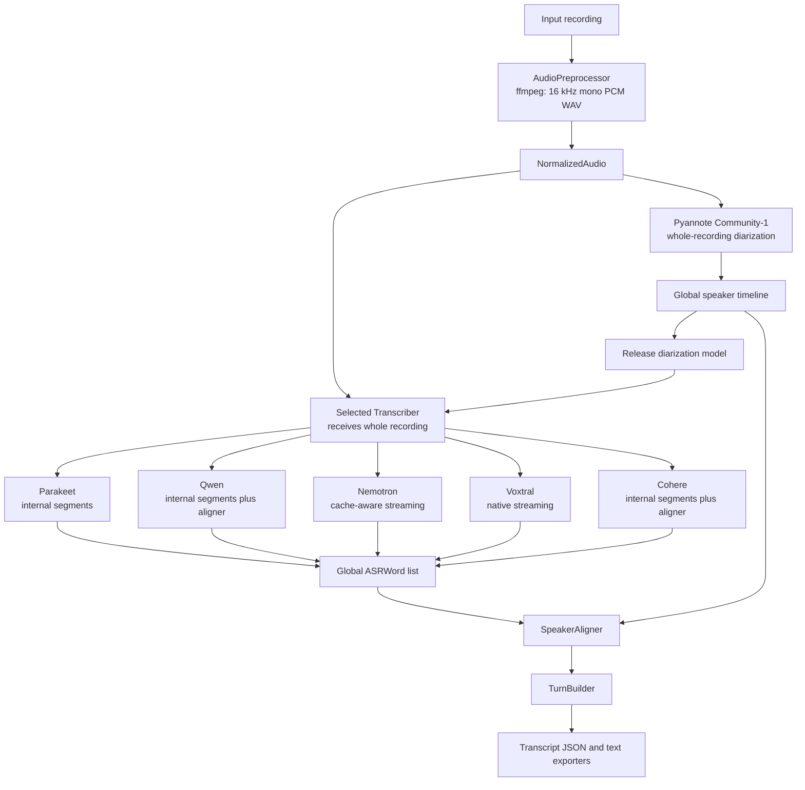

# Speech Transcription Pipeline

Local, batch-friendly speech transcription with anonymous pyannote Community-1 diarization. It has no summarization, API service, remote inference, NeMo, or vLLM dependency.

## Architecture



Audio segmentation is not part of the generic pipeline. Each ASR backend owns its own long-form processing strategy and returns finalized, globally timestamped `ASRWord` values. Pyannote owns canonical speaker identity; ASR speaker labels are never used.

## ASR Backends

- `parakeet`: `nvidia/parakeet-tdt-0.6b-v3`. Native TDT word timestamps, punctuation, capitalization, and internal 180-second segments with 15-second overlap.
- `qwen`: `Qwen/Qwen3-ASR-1.7B-hf` plus `Qwen/Qwen3-ForcedAligner-0.6B-hf`. Qwen recognizes bounded 240-second internal segments with 15-second overlap, releases ASR, aligns all recognized segments once, then reconciles them. Collapsed 80 ms-grid boundaries are interpolated and reported in metadata. The aligner limit is 300 seconds.
- `nemotron`: `nvidia/nemotron-3.5-asr-streaming-0.6b`. Native Transformers RNNT cache-aware streaming, explicit language conditioning, native token emission timestamps, and internal token-to-word aggregation. Batch transcription defaults to 13 lookahead tokens (1.12s latency) for the model's highest-accuracy streaming configuration. It does not issue independent ASR requests for long-form audio.
- `voxtral`: `mistralai/Voxtral-Mini-4B-Realtime-2602`. Native Transformers cache-aware streaming in one continuous `generate()` session using processor-defined buffers and EOF padding. `[STREAMING_WORD]` token positions provide approximate emission-group end times; starts remain unset for speaker alignment to infer.
- `cohere`: `CohereLabs/cohere-transcribe-03-2026` plus `Qwen/Qwen3-ForcedAligner-0.6B-hf`. Cohere recognizes 30-second internal segments with 5-second overlap, releases ASR, aligns all recognized segments once, then reconciles them. Cohere supplies text only; the Qwen aligner supplies word timestamps.
- Diarization: `pyannote/speaker-diarization-community-1` runs once over the normalized full recording.

Nemotron word intervals are aggregates of RNNT token emission times, not manually aligned acoustic boundaries. Leading-space tokenizer markers start words; trailing punctuation attaches to the preceding word; opening punctuation attaches to the following lexical token.

All adapters use deterministic inference, `model.eval()`, `torch.inference_mode()`, and `trust_remote_code=False`. CUDA uses FP16 on Turing-class GPUs and BF16 only when PyTorch verifies support; CPU uses FP32.

## Language

The pipeline is language-agnostic. The default ASR language is `de-DE` and can be changed with the `LANGUAGE` environment variable or the `--language` CLI flag. Qwen and Nemotron accept a locale such as `de-DE`; the Qwen ASR and forced-aligner stages use the base language code (for example `de`). Cohere is initially available for the nine languages supported by both Cohere and the required forced aligner: `de`, `en`, `es`, `fr`, `it`, `ja`, `ko`, `pt`, and `zh`.

## Dependencies

| Package | Version |
| --- | --- |
| Python | `>=3.11,<3.14` |
| torch | `2.8.0` |
| torchaudio | `2.8.0` |
| torchcodec | `0.7.0` |
| transformers | `5.13.0` |
| accelerate | `1.12.0` |
| librosa | `0.11.0` |
| mistral-common | `1.10.0` with `audio` extra |
| pyannote.audio | `4.0.7` |
| numpy | `2.2.6` |
| sentencepiece | `0.2.1` |
| protobuf | `7.36.0` |
| nagisa | `0.2.11` |
| soynlp | `0.0.493` |

Install the appropriate PyTorch CPU/CUDA wheel first when required, then install the project:

```bash
python3.11 -m venv .venv
.venv/bin/pip install --upgrade pip
.venv/bin/pip install -e '.[dev]'
```

`ffmpeg` and `ffprobe` must be on `PATH`.

## Commands

```bash
speech-transcriber transcribe audio.m4a --asr parakeet --output ./result/parakeet --device cuda
speech-transcriber transcribe audio.m4a --asr qwen --output ./result/qwen --device cuda
speech-transcriber transcribe audio.m4a --asr nemotron --output ./result/nemotron --device cuda
speech-transcriber transcribe audio.m4a --asr voxtral --output ./result/voxtral --device cuda
speech-transcriber transcribe audio.m4a --asr cohere --output ./result/cohere --device cuda
```

Compare all production configurations with one normalization and one diarization pass:

```bash
speech-transcriber compare audio.m4a \
  --models parakeet,qwen,nemotron,voxtral,cohere \
  --output ./comparison --device cuda
```

Comparison executes ASR backends sequentially and releases each model before loading the next one. It does not force common segments on models with incompatible long-form behavior.

### Backend Configuration

CLI values override environment values, which override defaults.

```text
ASR_BACKEND
ASR_MODEL
QWEN_ALIGNER_MODEL
PYANNOTE_MODEL
PARAKEET_SEGMENT_DURATION
PARAKEET_SEGMENT_OVERLAP
QWEN_SEGMENT_DURATION
QWEN_SEGMENT_OVERLAP
COHERE_SEGMENT_DURATION
COHERE_SEGMENT_OVERLAP
NEMOTRON_NUM_LOOKAHEAD_TOKENS
LANGUAGE
DEVICE
WORKING_DIRECTORY
NUM_SPEAKERS
MIN_SPEAKERS
MAX_SPEAKERS
KEEP_INTERMEDIATE_FILES
LOG_LEVEL
HF_HOME
HF_TOKEN
```

Equivalent CLI flags include `--parakeet-segment-duration`, `--qwen-segment-duration`, `--cohere-segment-duration`, and `--nemotron-num-lookahead-tokens`. There is intentionally no global `--chunk-duration` or `CHUNK_DURATION`: those old settings were removed because they incorrectly coupled backend implementations.

Nemotron validates an explicit lookahead through the loaded processor. Batch transcription defaults to 13 lookahead tokens; set `NEMOTRON_NUM_LOOKAHEAD_TOKENS` or `--nemotron-num-lookahead-tokens` to select another supported latency/accuracy trade-off. The checkpoint derives its first/subsequent streaming buffer sizes and latency from model/processor configuration.

Voxtral derives its first/subsequent buffers, transcript delay, and right EOF padding from the loaded processor. Its marker-derived end times are approximate, and multiple lexical words may share one native emission-group end time.

Cohere requires an explicit single language and does not supply timestamps or speaker labels. The Qwen forced aligner supplies its word intervals and pyannote supplies speaker attribution. Cohere access is gated by Hugging Face and requires accepting its contact-sharing conditions before prefetching. Like other encoder-decoder ASR models, Cohere may transcribe silence or low-volume noise; use speech-containing recordings for production runs until a VAD stage is added.

## Output and Metrics

`OUTPUT/transcript.json` is the canonical versioned output. Its word timestamps are seconds from the beginning of the normalized recording and are compatible with the pyannote timeline.

```text
comparison/
├── diarization.json
├── metadata.json
├── parakeet/
│   ├── asr_words.json
│   ├── metadata.json
│   ├── transcript.json
│   └── transcript.txt
├── qwen/
├── nemotron/
├── voxtral/
└── cohere/
```

Each backend metadata file records model/device/dtype, load time, ASR time, total backend time, RTF, peak CUDA memory, backend configuration, and backend-specific metrics. Forced-alignment backends record recognition, recognizer release, aligner load, alignment, and aligner release timings; Qwen also records interpolated timestamps, interpolation run/cap diagnostics, and clipped/dropped trailing-boundary words with their maximum overflow. Cohere also records its language, punctuation setting, and generation limit. Nemotron records language, lookahead, streaming latency, and `stream_buffers_processed`; Voxtral records native delay, right padding, stream buffer counts, and any `inferred_final_emission_groups` used for an unmarked EOF tail.

With `--keep-intermediate`, generic diarization, ASR words, and attributed words are retained under `OUTPUT/intermediate`. Backend-specific state remains internal and is never added to the canonical transcript schema.

## Offline and Air-Gapped Models

On an approved connected staging system, prefetch artifacts:

```bash
HF_TOKEN=hf_... speech-transcriber prefetch-models --asr parakeet
HF_TOKEN=hf_... speech-transcriber prefetch-models --asr qwen
HF_TOKEN=hf_... speech-transcriber prefetch-models --asr nemotron
HF_TOKEN=hf_... speech-transcriber prefetch-models --asr voxtral
HF_TOKEN=hf_... speech-transcriber prefetch-models --asr cohere
```

Qwen and Cohere prefetch include the configured Qwen forced-aligner artifact. Cohere requires accepting its gated-model access conditions first.

Also obtain the accepted pyannote artifact through the approved process. Transfer approved artifacts and externally generated checksums through the air gap. A production volume can use:

```text
/models/
├── pyannote-community-1/
├── parakeet-tdt-0.6b-v3/
├── qwen3-asr-1.7b/
├── qwen3-forced-aligner-0.6b/
├── nemotron-3.5-asr-streaming-0.6b/
├── voxtral-mini-4b-realtime-2602/
└── cohere-transcribe-03-2026/
```

Run with mounted local paths and no runtime network access:

```bash
HF_HUB_OFFLINE=1 \
TRANSFORMERS_OFFLINE=1 \
ASR_BACKEND=nemotron \
ASR_MODEL=/models/nemotron-3.5-asr-streaming-0.6b \
PYANNOTE_MODEL=/models/pyannote-community-1 \
speech-transcriber transcribe /data/audio.m4a --output /data/result --device cuda
```

With all required artifacts mounted locally, inference performs no network access, telemetry, NVIDIA API calls, or remote-code loading.

## Podman and Kubernetes

Build the single non-root, arbitrary-UID compatible image:

```bash
podman build -t speech-transcriber:local -f Containerfile .
```

```bash
podman run --rm --device nvidia.com/gpu=all \
  --userns=keep-id --user "$(id -u):$(id -g)" \
  -e HF_HUB_OFFLINE=1 -e TRANSFORMERS_OFFLINE=1 \
  -e ASR_BACKEND=nemotron \
  -e ASR_MODEL=/models/nemotron-3.5-asr-streaming-0.6b \
  -e PYANNOTE_MODEL=/models/pyannote-community-1 \
  -v "$PWD/input:/input:ro,Z" -v "$PWD/result:/output:Z" \
  -v "$PWD/work:/work:Z" -v "$PWD/models:/models:ro,Z" \
  speech-transcriber:local transcribe /input/audio.m4a \
  --output /output --working-directory /work --device cuda
```

`deploy/k8s/job.example.yaml` is a generic `batch/v1` Job that requests one GPU and demonstrates the same mounted-local-model offline mode on any Kubernetes cluster. No model weights or secrets are baked into the image.

## Verification

Normal tests download no models and require no GPU:

```bash
uv run pytest
uv run ruff check .
uv run mypy src/speech_transcriber
```

An optional real-model smoke test requires predownloaded local artifacts, a WAV, and `RUN_MODEL_TESTS=1 MODEL_TEST_BACKEND=nemotron MODEL_TEST_AUDIO=/path/to/audio.wav uv run pytest tests/integration`.
